# 3D print sandbox

Six parametric things live here so far.  All of them are plain Python --
shapely for the 2-D work, trimesh and manifold for the solids -- and all of
them re-run in seconds.  The phone case is the exception on every count: it
needs nothing but the standard library, and it writes g-code rather than a
mesh.

- **[NFC fobs](#nfc-fobs)** -- a keyring fob printed as two halves with an NFC
  tag glued between them, in up to four colours, in one of three layouts.
  Comes with a browser front end.  The wallet-sized business card it was
  written for is [archived](#the-archived-business-card): the builder is still
  here and the command line still writes one, but the app does not offer it.
- **[Name keyrings](#name-keyrings)** -- the word itself, welded into one
  printable piece, with a tab for the ring, in one of forty-eight faces.  Same
  app, second shape.
- **[Sign enclosures](#sign-enclosures)** -- a shallow light box with the word
  lit through its own face: an opaque layer with the letters taken out, the
  letters filled back in in something translucent, and a diffuser behind the
  lot.  Same app, third shape.
- **[Stencils](#stencils)** -- a plate with the word, or an SVG, cut clean
  through it to paint through, every island bridged so the middles stay in.
  Same app, fourth shape.
- **[Car-brand valve caps](#car-brand-valve-caps)** -- Schrader valve stem caps
  with a car maker's emblem on top.  Twelve marks.
- **[Phone cases](#phone-cases)** -- a case for any of seventeen iPhones,
  painted on the back with your own SVG by the AMS.  The odd one out: it is
  g-code rather than a solid, written directly with no slicer, and its
  generator is vendored from another repository.  Its own page in the app,
  which keeps what you have downloaded and where you left off.

---

# NFC fobs

Five fields in, a keyring fob out: your details on the front, laid out by one
of three layouts; a pocket for an NFC tag and the contactless arcs on the back.
Tapping a phone to it opens whatever you wrote on the tag -- a listing, a
booking page, a vCard -- and pointing a camera at the QR code does the same for
phones that do not tap.

Two things shape everything below.  **It prints as two halves** that you glue
together with the tag sandwiched between them, so nothing of the tag shows and
neither face has a hole in it.  And **everything you can see is an inlay in one
thin face layer**, 0.6 mm deep, in up to four colours -- so a multi-material
printer does all its colour changes in the first three layers of each half and
prints the rest in one colour.

| | |
|---|---|
|  |  |
| 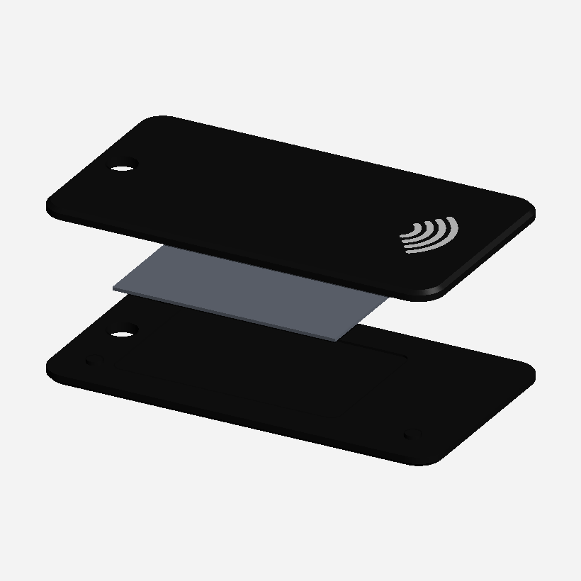 | 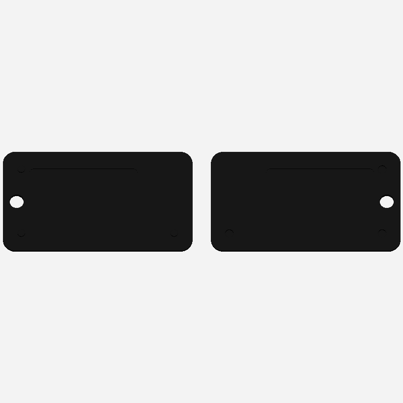 |

Top, the two faces of the finished fob.  Bottom left, what it is: two halves and
the tag that goes between them.  Bottom right, the same two halves as they print,
both face down on one plate.

## What goes on it

The field list is not arbitrary.  Every guide to business cards names the same
five things -- **name, job title, company, phone, email** -- and then warns
against a sixth and a seventh: a card with five to seven pieces of contact
information gets followed up on, and one with ten does not
([Wave Connect](https://wavecnct.com/blogs/news/what-to-put-on-business-card),
[Vistaprint](https://www.vistaprint.com/hub/business-card-information-essentials),
[UPrinting](https://www.uprinting.com/10-parts-of-modern-business-cards.html)).
So those five are the fields, each one optional, and the rest -- fax numbers,
a postal address, a row of social handles -- is deliberately not offered.

The one modern addition worth making is a link, which is what this thing is
for: an NFC tag and a QR code both point at a URL you control and can
re-point later without reprinting a single card.

On size, there are three standards and they are close enough to be confusing:

| | Size | Where |
|---|---|---|
| US | 88.9 x 50.8 mm (3.5 x 2 in) | North America |
| ISO 7810 ID-1 / CR80 | **85.6 x 54 mm** | credit cards, and what this generates |
| EU / UK | 85 x 55 mm | Europe |

The card here is CR80, the credit-card outline, because that is the one that
fits the card slot in a wallet -- the place a plastic card has to survive
([Gelato](https://www.gelato.com/blog/business-card-size-guide),
[PrintPlace](https://www.printplace.com/articles/standard-business-card-sizes),
[Blank Plastic Cards](https://www.blankplasticcards.com/blog/what-is-cr80-card-size-the-complete-guide-to-standard-plastic-card-dimensions/)).
A US card is 3.3 mm wider and 3.2 mm shorter, a European one 0.6 mm narrower
and 1 mm taller; `CARD` in `src/cards.py` is two numbers if you want either.

## The app

```
pip install numpy trimesh manifold3d shapely mapbox_earcut networkx pillow fonttools segno svgpathtools
python3 src/app.py
```

opens `http://127.0.0.1:8765`.  Type in the boxes and the part rebuilds as you
go, about half a second a time.

The panel goes in the order the decisions do.  **Shape** comes first, because a
fob, a name keyring, a sign and a stencil are different objects and everything
below reads differently for each -- a stencil has no colours to sort, a sign has
no tag to fit, and five lines of type on a fob come out small enough that you
want to leave the title or the email off it.  Then who you are, then how it
looks, then the tap side, then a batch of them.

**Every control lights up what it makes.**  Put the cursor in the Email box, or
just run it over the label, and the email on the part turns cyan while
everything else goes grey; the readout at the top left names what you are
looking at.  If the thing lives on the other face -- the tap mark, the QR code
-- the part turns over to show you.  If it is the tag itself, the view opens
the joint and lights the tag sitting in it.  It is the quickest way to answer
"which bit does this change?", and it needs no explaining: every run of
triangles the server sends carries the field it came from.

**Every description is folded behind a `?`.**  There is a paragraph of
reasoning under nearly every control here -- why 0.8 mm, what a bridge is
holding, which five lines a card should carry -- and all of it at once is a wall
of grey nobody reads.  Folded, the panel is the list of choices it is: run the
cursor over a mark and the paragraph under it opens, take it off and it closes,
click it to pin it open, which is the way in on a touch screen and the way back
out of a long one.  Tabbing to a mark opens it too, so the reasoning is there
without a mouse.  The one line that is not a description -- the byte count under
the link box, which answers rather than explains -- stays where it is; and with
the script off every paragraph is simply on the page, unfolded.

The viewer has three views of the same part, because a thing that prints in two
pieces and arrives as one needs both told: **Glued up** is the finished fob,
**Pulled apart** opens the joint and puts the tag in the gap, and **On the
plate** is the two halves lying face down the way they print.  The buttons are
top right; they only appear when there are two pieces to show -- on a sign they
read *Put together*, *Lid off* and *On the plate*, which is the same three
things about a box.

**Download 3MF** saves the part with each colour as a separate component in one
object, so Bambu Studio, PrusaSlicer or Orca open it already knowing which
filament goes where -- assign four and print.  **STL** saves one welded solid
instead, for anything that does not read 3MF.

A slider sets how far the lettering stands off the face.  The default is flush,
which is the point of the face layer: a smooth card you read rather than feel,
with every colour in the same three layers.  Turn it up and the lettering
stands proud -- 1.2 mm is enough to feel with a thumb -- at the cost of a
colour change on every layer the relief runs through.

The link box counts the bytes an NDEF record would take and says which NTAGs it
fits; tick **QR code** and the same link is laid into the back as a code.  An
SVG in the **Logo** picker goes on the front beside the name; an SVG in the
**Full front design** picker *is* the front -- your own artwork, lettering and
all, scaled to fill the face.  Whenever a code or a logo is on the part, the
readout names the **nozzle it needs** -- see below.  Nothing here writes a tag.

The **Batch** box takes one person per line -- name, company, phone, link --
with commas or tabs between, so a column of a spreadsheet pastes straight in.
While there is anything in it, the preview and both downloads are the whole
batch laid out on one plate, wrapped to the plate width you give it, every card
sharing the settings above it and each carrying its own link.

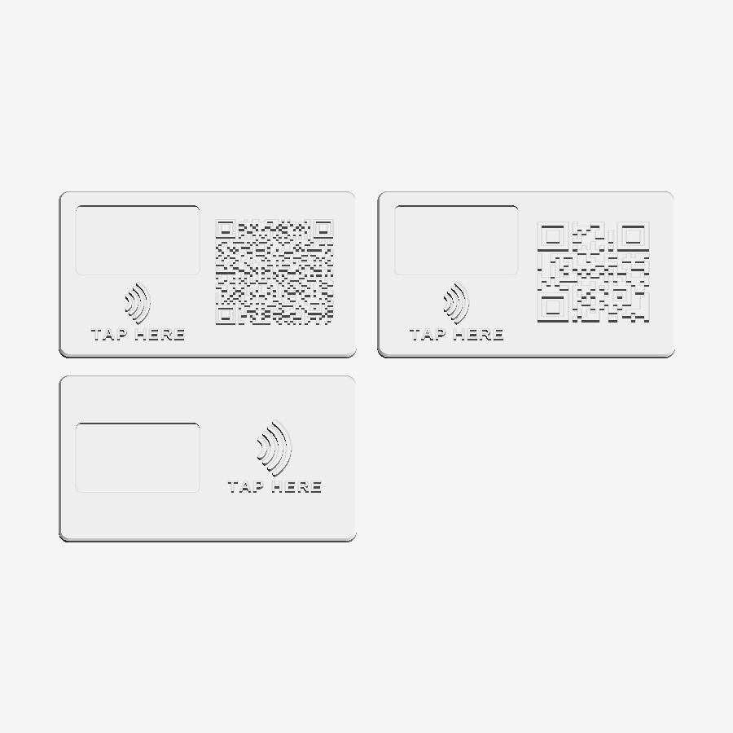

The page is styled on Figma's [Simple Design
System](https://www.figma.com/community/file/1380235722331273046/simple-design-system):
Inter, a near-black brand colour on white, 1 px borders, 8 px radii and an
8-based spacing scale, with its token names kept in the stylesheet's `:root` so
the values can be swapped for the file's own.  The one part not drawn to that
system is the jetpack that flies across the viewer while a build runs -- it is
anand_4957's loader from [Uiverse.io](https://uiverse.io) (MIT), kept as
written apart from taking its colours from the tokens, and credited in the
stylesheet.  The server is standard library
only and the viewer is hand-written WebGL, so there is no framework to install,
nothing fetched from a CDN, and it works with the network off.  It listens on
the loopback address; it is a tool for the machine it runs on, not a service to
put on a network.

### Dark

Both pages follow whatever the machine is set to.  There is no switch, because
a switch is a preference to store, ask about and get wrong, and the operating
system has already been asked: one `@media (prefers-color-scheme: dark)` block
redefines the tokens, and every rule in either stylesheet is written against
those, so the components themselves are the same in both.  `color-scheme` is
declared as well, so the controls the browser draws itself -- scrollbars, the
range thumb, the checkbox, the colour wells -- come along rather than staying a
light island in a dark page.

Two things do not inherit ink and so are written twice.  The select chevron is
a data URI, so it is a token like everything else rather than a rule that would
have to sit in the right place in the sheet to win.  The WebGL viewer's
background is read off `--bg-secondary` at startup and again when the setting
changes, rather than being the same grey typed a second time in JavaScript --
and it is read as the hex that is actually in the stylesheet, because a custom
property comes back from `getComputedStyle` exactly as it was written, not as
the `rgb()` an ordinary property would answer with.

The case preview carries its own colours: `src/phonecase/preview.py` emits a
`<style>` block of custom properties with a dark variant, so the sheet is dark
inlined in a dark page, and still dark if you save it and open it on its own.
**The filament colours are not in that block.**  The artwork is stroked in the
colour the AMS will actually lay down, which is the one thing about that
picture that must not change with the lights -- a white part on a white sheet
is the truth about a white part.

### Hosting it

The repo deploys to Vercel as it stands: `api/model.py` hands Vercel the same
`Handler` the local server uses, `public/` is the page and `requirements.txt`
the dependencies; `.vercelignore` keeps the valve-cap STLs out of the build.
Zero-config, with one thing that is easy to get wrong: Vercel finds the
handler by looking *inside* the entrypoint for a class defined there -- import
one under the name and the file builds as nothing, silently.  It lives at
**https://3-d-print-sandbox.vercel.app** -- the Vercel project is linked to
this repo, so every push builds: the default branch goes to that address, any
other branch gets a preview address of its own (which asks for a Vercel login;
the production one is public).  The URL then works from any phone or laptop
with nothing installed.

Two things follow from running on a function: the preview comes back gzipped (a
batch plate would otherwise hit the response ceiling), the first request after a
quiet spell takes a few seconds while Python and the geometry libraries load,
and a batch of more than a few dozen QR cards will run past the 60-second limit
-- split it, or run that one locally.

The same thing from a terminal:

```
python3 src/gen_cards.py --name "Jane Doe" \
                         --company "Bluewater Realty" \
                         --phone "(555) 214-8890"
```

writes `stl/jane_doe_fob.3mf` and the two halves as `.stl`, and reports the
lettering sizes, the stroke widths, the cavity and where the colours are.
`--kind card`, `--look navy`, `--layout student`, `--role "Senior Agent"`,
`--email jane@example.com`, `--logo-box`,
`--colours "#1f2a44,#2c3a5c,#e8c15a,#cfd3d6"`, `--logo brand.svg`,
`--design front.svg`, `--link URL --qr`, `--batch people.txt`, `--rise 1.2`,
`--format 3mf`, `--tag 38x19`, `--tag-mode pocket|embed|split`,
`--tap "SCAN ME"`, `--border`, `--chamfer 0`, `--font`, `--preview` and the rest
are in `--help`.

## The face, and the four colours

The face is one layer of the print, `FACE` = 0.6 mm deep, and everything
visible is cut into it and filled: the body colour wherever nothing else is,
then three more.

| Slot | What it carries |
|---|---|
| **body** | the slab, and the face wherever nothing else is |
| **pattern** | the background pattern |
| **primary** | name, phone, logo, the contactless arcs, the QR code |
| **secondary** | company, the rule under it, the tap wording, the border |

Printed face down, that is the first three layers at 0.2 mm.  All four
filaments are used there and nowhere else, so the tool changes -- the slow,
wasteful part of multi-material printing -- happen at the very bottom of the
part and the remaining 1 mm of each half prints in one colour.  The readout
gives the band as a height, so the same thing works on a single-nozzle printer
with a filament change or two.

### The looks

A **preset** is a layout, a pattern and four colours together.  Ten of them
ship, in `src/looks.py`, and picking one sets every control below it; change
any of them afterwards and the preset box says Custom.

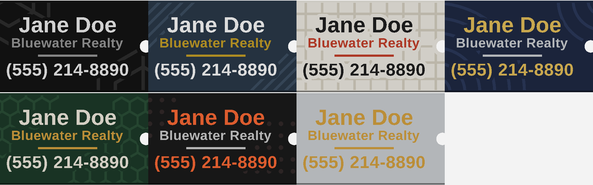

Left to right, top row: **Print Lab** (the default), **Student**,
**Corporate**, **Citrus**, **Slate**; bottom row: **Paper**, **Navy**,
**Forest**, **Ember**, **Plain**.

The patterns come in two kinds.  The line ones -- `cubes`, `stripes`, `grid`,
`hexes`, `rings`, `dots` -- are strokes, and `looks.STROKE` is their width:
1.1 mm, two nozzle widths and a bit.  The solid ones -- `disc` (a big circle
off the top-right corner), `hexband` (hexagons along the bottom edge) and
`badge` (both) -- are areas, and are what the `corporate` layout is drawn to
sit on.  All of them are built as geometry rather than drawn as pixels, so
every width is a number you can read and print.

Each is clipped to the face inside the chamfer, and to a 1.25 mm halo round
everything else on it, so the lettering keeps its air and stays legible where a
big shape runs behind it.  Anything left narrower than half a stroke, or
smaller than `MIN_PIECE`, is dropped rather than printed as a speck.  The
hexagons in a band are drawn at 88% of their cell for the same reason the
strokes are handed to the boolean separately: packed edge to edge they union
into one polygon whose boundary touches itself, and that will not extrude.

### The layouts

A **layout** decides where the fields go on the front.  Three ship, and the
fields they use differ, so `role` and `email` sit empty until a layout has a
place for them.

| `--layout` | What it is | Uses |
|---|---|---|
| `centred` | Name, company, title, a rule, then phone and email, stacked in the middle, with a logo to the left of them.  Shrinks to fit rather than running off the face, which is what six lines on a fob would otherwise do.  The one that copes with a fob. | all five, logo |
| `student` | Name big at the top left, a logo square at the top right, two lines of who-you-are under the name, and an address along the bottom right behind a pair of chevrons. | name, title, company, email or phone, logo |
| `corporate` | A mark and the company across the top left, a slogan under it, the person down in the bottom left.  Leaves its bottom eighth clear for a `badge` pattern. | company, title, name, phone, email, logo |

The chevrons in front of the address are built from a polyline in
`cards.chevrons()` rather than set from the font's own `>`, for the reason the
contactless arcs are: the stroke width is then a number you can turn up until
it prints.

A layout that expects a logo and has not been given one can draw a
**placeholder** instead -- `--logo-box`, or the checkbox in the app.  It is a
placeholder in the literal sense, an empty square with the word Logo in it,
showing where the artwork goes and how big it can be; hand over an SVG or turn
it off before printing the real thing.  The `corporate` layout falls back to a
plain hexagon, which is a mark rather than a note to yourself.

Small type is what bites here.  A layout that fills a card puts three or four
sizes on it, and the smallest of them -- an email address along the bottom --
comes out around 2.5 mm tall with strokes near 0.4 mm.  That is an *inlay*, a
cut in the face that another filament has to fill, so it wants a 0.4 mm nozzle
at the outside and prints better on a 0.3.  The readout names every line it
measures under 0.8 mm; believe it, and shorten the text or move up a body size
rather than hoping.

### Colours in your own artwork

`--logo` and `--design` read the **fill of every shape** in the SVG and send it
to the slot whose colour it is nearest, so a logo drawn in two colours prints in
two.  Shapes filled in the body colour are dropped as background -- draw your
card on a black rectangle, pick a look with a black body, and what you get is
the artwork on the body at the rectangle's size, which is what you meant.
Shapes with no fill at all go to primary.

## The two bodies

| | Fob (default) | Card (archived) |
|---|---|---|
| Outline | 62 x 34 mm, r4, with a Ø4.6 mm split-ring hole | 85.6 x 54 mm, r3.18 -- CR80, the size of a credit card |
| Thickness | 1.6 mm a half, 3.2 mm glued up | 1.3 mm a half, 2.6 mm glued up |
| Face | 0.6 mm, four colours | 0.6 mm, four colours |
| Name / company / phone caps | 5.6 / 3.4 / 4.4 mm | 7.2 / 4.4 / 5.4 mm |
| Border | no | optional |
| Edge | 0.6 mm chamfer, both outer faces | same |
| Uses | ~6 cm³ | ~11 cm³ |

The fob is the one that is left, and it was always the one people keep: it goes
on a keyring, it is cheaper in filament and time, and it grows if the tag or the
QR code needs more room than 62 x 34 mm leaves them.  The card does not grow,
and says so instead.

### The archived business card

The wallet-sized card is **archived**: the app does not offer it any more and a
request for one comes back with an error saying so.  Nothing about it has been
deleted -- `CARD` and every layout that serves it are still in `src/cards.py`,
and the command line still builds one:

```
python3 src/gen_cards.py --kind card --name "Jane Doe" --company "Bluewater Realty"
```

It went because the thing people actually wanted a flat parametric body for
turned out to be the [sign enclosure](#sign-enclosures), which now has the
card's place in the app.  Everything the card shares with the fob -- the face
layer, the four colours, the three layouts, the logo and QR paths, the split
body -- is the fob's too and is maintained as the fob's; what is unmaintained is
the CR80 body itself and the `--border` line that only a card had.

A line that is too long shrinks to fit rather than running off the edge, so a
long brokerage name comes out smaller, not broken.  Past a point that stops
being printable, so any of the three fields can carry a `|` where it should
break instead -- `--company "Coast & Key|Property Group"` sets two lines at
full size, which on a fob is the difference between 0.50 mm strokes and
0.36 mm ones.

The outer edges carry a 45° chamfer of 0.6 mm -- it is what stops a card
feeling like a coaster.  It is a true loft, not a stack of steps:
`rounded_rect()` and the same rectangle inset by the chamfer are built the same
way, so they correspond vertex for vertex and skin cleanly.  `--chamfer 0` for a
square edge.  Only the outer faces get it; the glue joint stays square.

Lettering is pulled straight out of a TTF by `src/trace_text.py` -- glyph
outlines as curves, flattened, not rasterised and re-traced.  A card is always
set in the sans: whichever of Liberation Sans Bold, DejaVu Sans Bold or Arial
Bold is on the machine, `--font` for any other.  A heavy sans is the right
answer here, because every stroke has to survive as a 0.6 mm-deep inlay.  The
[name keyrings](#the-forty-eight-faces), whose letters are ten times the size
and are the object rather than a label on one, have forty-eight to choose
from -- six plain and forty-two display faces.

## The tag, and the arcs

The cavity is cut to the tag you actually bought: `--tag WxH` plus
`--tag-thick`, with 0.4 mm of slack all round and at least 0.8 mm of plastic
over it.  Default is 35 x 22 x 0.5 mm, a common rectangular NTAG213 sticker.
**Measure yours** -- sellers' "25 mm" tags are anything but consistent.

Three ways to fit it:

| `--tag-mode` | What it does | Trade |
|---|---|---|
| `split` (default) | Two half-thickness parts to glue together with the tag sandwiched between them. | No pause, no hole in either face, nothing of the tag showing -- at the cost of a glue-up. |
| `pocket` | Recess open at the back; peel the sticker and press it in when the print comes off the plate. | One part, but the recess is visible. |
| `embed` | The same recess roofed over with 0.6 mm of plastic. | One part and invisible, but you have to pause the print at the height it reports and drop the tag in. |

The mark beside the cavity is the four-arc contactless symbol -- the "wifi on
its side" everyone already reads as *tap here*.  It is built from arcs in
`cards.contactless()` rather than traced, so the stroke width is a number you
can turn up: 1.20 mm on the card and 0.87 mm on the fob, two to three nozzle
widths, which prints cleanly.  The NFC Forum's N-Mark and the EMVCo indicator
are registered marks and these plain arcs are neither.

### The two halves

Split mode emits two parts instead of one -- `..._fob_front.stl` and
`..._fob_back.stl` from the command line, or both on one plate from the browser.
The cavity is cut half into each mating face, so the tag ends up on the neutral
plane of the finished part with a millimetre of plastic either side, which is
both the strongest arrangement and the only one where no part of the tag shows.

| | |
|---|---|
| 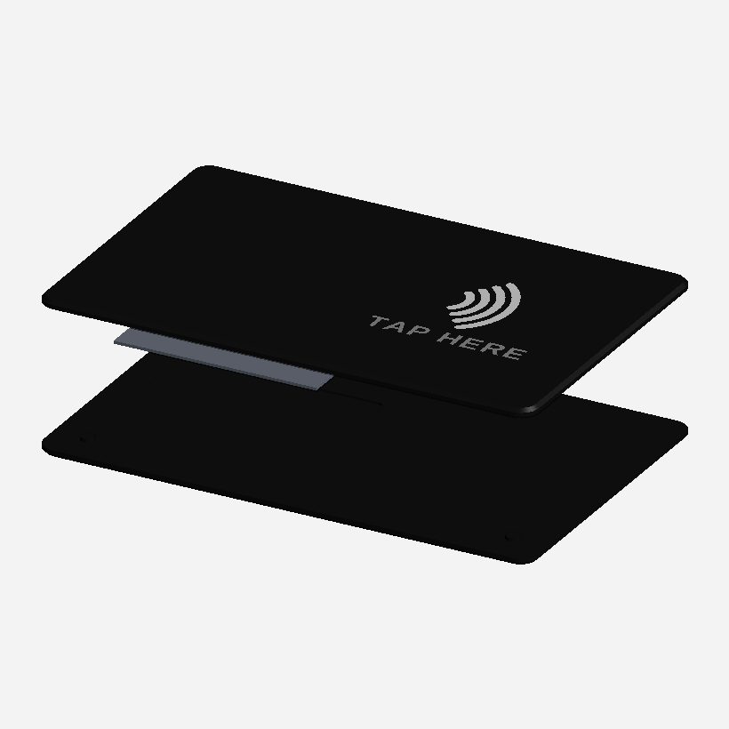 | 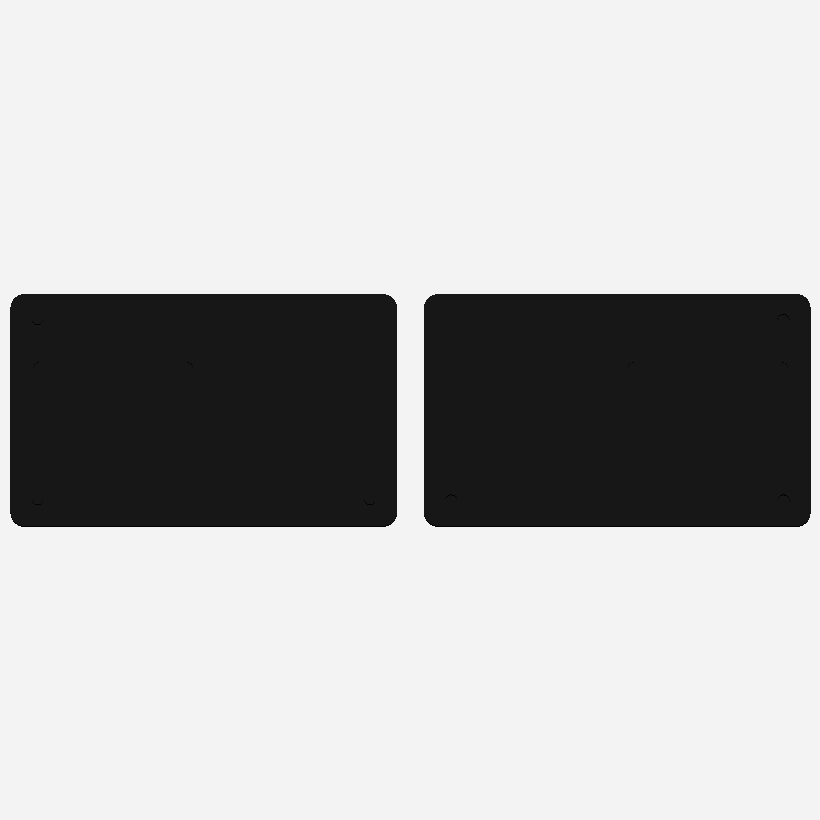 |

These two are the [archived card](#the-archived-business-card) rather than the
fob, because a big flat body shows the joint better than a small one; the
mechanism is the fob's and is unchanged.

- The body is **0.4 mm thicker** than a one-piece version to pay for the cavity.
- **Three register pins, not four.**  Ø2.4 x 0.6 mm studs on the front half,
  0.15 mm-clearance sockets on the back.  Three corners of a rectangle make an
  L, and an L does not map onto itself under any flip or half-turn -- so the
  halves only go together one way, and you cannot glue the back on upside down
  and find out when it sets.  A tag that fills the body wall to wall leaves no
  room for pins, in which case the reported count comes back 0 and you line the
  halves up on the outline instead.
- Both halves print **face down**, so each takes its colour changes in the
  first three layers and none after.
- Glue it with plastic cement or thin CA on the flat border outside the cavity,
  not in it -- the tag does not want to be soaked.  Clamp it under a book.

### Logo, QR code, and the nozzle they need

`--logo brand.svg` puts the logo on the front, to the left of the name, at 62%
of the face height (`--logo-height` to change).  `--design front.svg` goes
further and replaces the front entirely -- name, company, phone, logo and
pattern -- with the artwork, scaled to fill the face inside the margin.  Set
your card up in Illustrator or Inkscape at 85.6 x 54 mm, convert the text to
outlines, and hand it over; the readout then says the finest thing in it and the
nozzle that needs.  `trace_svg.shapes()` reads it: paths, rects, circles,
ellipses and polygons, filled; subpaths within one element combine even-odd (so
a letter keeps its counter), separate elements union (so overlapping shapes read
as "and", not as a hole), and fills are grouped by colour.  Strokes, gradients,
text objects and transforms are ignored -- export the logo as flat outlines
first, which every vector editor will do.

`--link URL --qr` lays a QR code for the link into the back, on the right; the
cavity and the mark move to the left.  The code is sized to the room it has, and
that is the whole game: **a shorter link is a coarser code, and a coarser code
prints on a bigger nozzle.**

| Link | Modules | Module on a card | Needs |
|---|---|---|---|
| `https://bit.ly/abc123` (22 chars) | 25 | 1.28 mm | 0.6 mm nozzle |
| realtor.ca listing link (80 chars) | 37 | 0.91 mm | 0.4 mm nozzle |
| realtor.ca agent link (108 chars) | 41 | 0.83 mm | 0.4 mm nozzle |

The rule behind "needs" is that a feature prints clean when **two extrusion
lines fit across it**, so the nozzle a feature needs is the largest common one
no more than half its width.  The same rule is applied to the finest detail in
the logo -- counting its holes, since a counter narrower than a nozzle fills in
exactly as a stroke narrower than one smears -- and the readout reports the
tighter of the two.  A code that would need modules under 0.5 mm is refused
rather than printed unreadable: use a shorter link, or the fob, which grows to
fit its code at 0.8 mm a module.

Two things about the code as printed: it is the *primary* colour that is dark to
a scanner, so keep primary darker than body if you can (navy on white scans;
white on navy is an inverted code, which most phones read and some do not).  And
the quiet zone round it is two modules rather than the four the spec asks for --
two is plenty against a matte print, and four would cost the code a size.  The
geometry is checked here by decoding it: the laid-in shapes, rasterised, read
back as the link they were made from.

Some notes on the tags themselves:

- **Nothing here writes the tag.**  Do that with a phone -- NFC Tools or
  similar -- writing a URL record, and lock it afterwards if you are handing
  them out.
- Capacity is rarely the problem.  An NDEF URI record costs the URL plus about
  8 bytes, less the 12 characters of `https://www.` that a prefix code stands
  in for.  A full realtor.ca listing link -- say the 80-character
  `.../real-estate/29064675/3-21091-lougheed-highway-maple-ridge` -- is 76
  bytes, and a 108-character agent link is 104.  **NTAG213 holds 144 bytes,
  NTAG215 holds 504 and NTAG216 holds 888**, so the whole link fits on any of
  them, with room on a 215 for a vCard beside it.  The app has a box to paste a
  link into and check.  A short link you control is still worth having, because
  you can re-point it when the listing sells.
- Plastic is transparent at 13.56 MHz, so a millimetre of plastic over the tag
  costs you nothing.  **Metal-filled, carbon-fibre and conductive filaments are
  not** -- they will kill the read.  Plain PLA, PETG, ABS and ASA are all fine.

## Printing

Both halves come out **face down**, which is how to print them: the face gets
the build-plate finish instead of being four thin top layers, and the cavity
opens upward so nothing has to bridge over it.  No supports.

- **Layer height 0.2 mm, or 0.15.**  The face is 0.6 mm, so three or four
  layers of colour and then a plain 1 mm.
- **Nozzle.**  0.4 mm prints every card in this README; the readout says when a
  code or a logo wants finer, and the table above says why.
- **Thin-wall detection on.**  At these sizes the smaller lines run 0.5-0.65 mm
  wide -- printable, but only if the slicer does not decide to drop them.  The
  generator prints the measured width of every line, and warns when one is
  under 0.8 mm.  If you want them fatter, shorten the text or raise the cap
  heights in `src/cards.py`.
- **Four colours on a multi-material printer:** open the 3MF.  Each colour is a
  separate component with its own material; assign a filament to each.  They are
  all spent in the first three layers, so the purge tower is short.
- **Fewer colours, or none:** set two or three of the four the same and the
  slicer merges them.  On a single-nozzle printer, print the STL and change
  filament at the height the readout gives.
- **Material:** PLA is fine for something that lives in a pocket.  PETG if it is
  going to sit on a dashboard in the sun.
- **Glue:** plastic cement or thin CA on the flat outside the cavity.  3-4
  perimeters, 20%+ infill.  A fob is about 6 cm³ and a few minutes.

## Changing things

`src/cards.py` holds the geometry: `CARD` and `FOB` carry every dimension, `TAG`
the default tag, `FACE` the depth of the colour layer, `RISE` the relief on top
of it, `CHAMFER` the edge break, `QR_QUIET` and `QR_MIN_MODULE` the code's
margins, `NOZZLES` the sizes the readout will name, `MIN_STROKE` the
printability threshold the warnings use.  `src/looks.py` holds the patterns and
the presets -- a new pattern is a function returning shapely polygons and a line
in `PATTERNS`.  `src/typefaces.py` holds the faces: a new one is a TTF
in `src/fonts`, its licence beside it, and a line in `FACES` saying which group
it belongs to, what weld and letter spacing it wants, and what smallest letter
height it needs -- `python3 src/measure_faces.py src/fonts/Yours.ttf` works
that last one out for you, `python3 src/gen_specimens.py` re-cuts the
picker's specimens so the new face's name is set in itself, and `python3
src/gen_faces_sheet.py` re-sets the name in every face for the picture above
(the specimens want `brotli` installed for the woff2 encoder -- a build-time
dependency, kept out of requirements.txt because the hosted function never
runs it).  There is a third place to touch: the page carries its own copy of
the table in `FACES` in `public/index.html`, so the picker knows a face's
floor without asking the server, and a new face needs a line there and its
group in `FACE_GROUPS` too.  `src/nametag.py`
and `src/stencil.py` are the two shapes that are not cards, and both return
what `cards.build()` returns, so the plate layout, the 3MF, the STL and the
viewer take them unchanged.  The layouts are `LAYOUTS` in `src/cards.py`: a new one is a
function taking the content box and the fields and returning polygons by colour
slot, plus a line in that dict and one in `LAYOUT_TITLES`.

Both bodies are prismatic, so everything is a shapely polygon extruded between
two heights.  Every piece is kept as its own solid, cut out of the body and
dropped back into the hole, and filed under two things: the **colour** it
prints in, which is what the 3MF's four materials are, and the **field** it
came from, which is what lets the app light one up at a time.  Welding the lot
is what the STL is.  `export_3mf()` writes the file by
hand -- one object per part, one component per colour, four base materials --
because the structure is the whole point and forty lines of XML put it exactly
where the slicers look.

Things that bite, all of them learned here:

- Hand the boolean engine the strokes *separately* rather than a shapely union
  of them.  A union of touching shapes is "valid", but its boundary touches
  itself and extruding that is not watertight.
- Clip a pattern to a face and you get polygons with a doubled vertex where the
  cut landed on an existing one.  Earcut turns that into an open mesh, so
  `prisms()` simplifies by a micron first -- finer than anything drawn here,
  coarser than the noise.
- The front face is laid out as you read it and then **mirrored**, because it
  ends up pointing at the build plate.  Anything that has to dodge the fob's
  ring hole has to dodge it on the other side -- `content_box(mirrored=True)`.
- `2 * area / perimeter` is the stroke-width estimate.  It reads low on
  letterforms with counters, whose perimeter runs well ahead of their area, so
  treat the reported number as a floor.
- In the viewer, do not multisample.  A boolean leaves needle triangles a few
  microns across, and rounding their corners to the single precision an STL
  stores opens sub-pixel cracks between them; MSAA resolves those cracks against
  whatever is behind the face and speckles it.  Supersampling -- a canvas bigger
  than it is shown -- antialiases without ever sampling a crack.

Personal cards are kept out of git: `stl/*_card*` and `stl/*_fob*` are ignored,
so `gen_cards.py` can write straight into `stl/` without the repo filling up
with other people's phone numbers.

---

# Name keyrings

No card, no tag, nothing to hold but the word.  Type a name, pick a face, get
the name: set tight, welded into one solid, with a tab at the left for the
split ring.

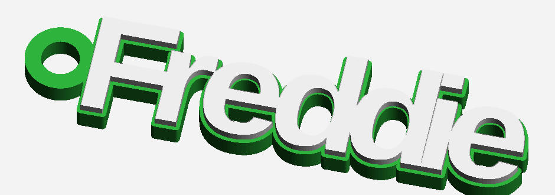

The whole problem is that **a word is not one thing**.  Set "Freddie" in any
font and you have seven separate solids, and seven separate solids is seven
pieces rattling round the print bed.  Three steps make it one:

1. **The letters are set by ink, not by the font.**  A font's side bearings are
   measured for running text on a page, where "LT" wants air between the L's
   foot and the T's arm.  Here each letter is walked left until shapely says
   its ink is a fifth of a millimetre from its neighbour's -- past touching,
   in fact, so most pairs are already joined before anything else happens.
   How far is the face's own business: a condensed face is mostly vertical
   stems, and an I welded to an E is one fat stem rather than two letters, so
   that one is set a third of a millimetre *clear* and left to the weld.
2. **Every glyph is grown by `weld` mm and the lot unioned.**  That closes
   whatever gap is left and fattens the thin strokes while it is there, and it
   is also the small outline you can see round the letters on every
   shop-bought one of these.  Growing a letter shuts its counter -- the hole in
   an a, e or o -- by the same amount, so the counters are cut back in
   afterwards and only the outside stays fat.
3. **Whatever is still loose gets a bridge.**  The dot of an i is its own
   contour floating over the stem; so is the dot of a j, and both halves of a
   name with a space in it.  Each pass finds the nearest loose piece and runs a
   1.2 mm bar -- three lines of a 0.4 mm nozzle -- along the shortest line
   between it and the word.  Bridging one dot beats welding the whole name fat
   enough to catch it.

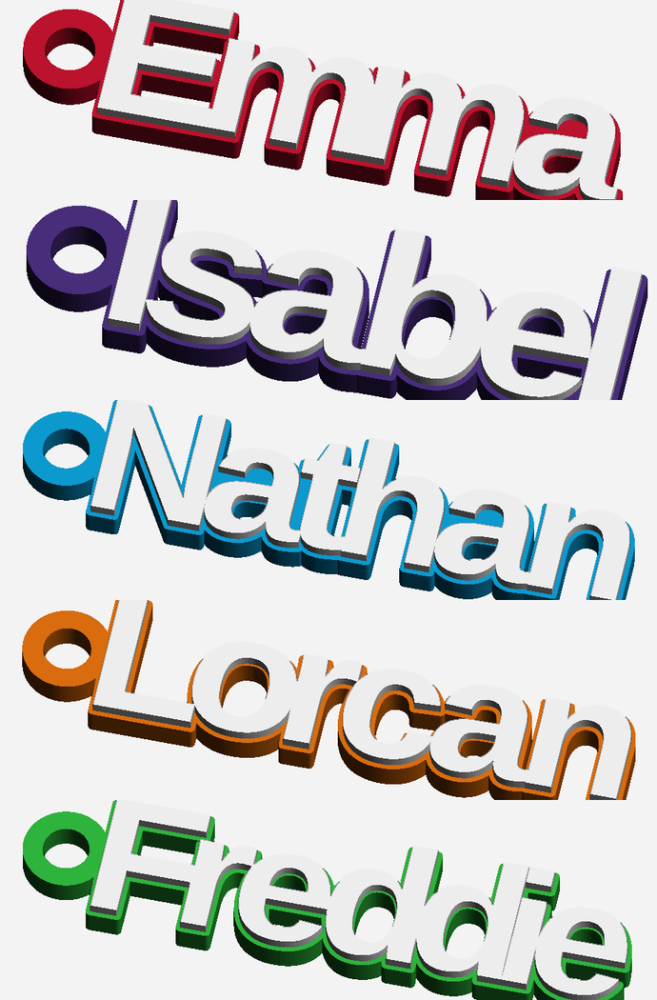

The letters then sit **1.2 mm proud of their own outline**, which is the two
colour version: body colour underneath, letter colour on top, one filament
change at 3 mm.  Turn that off and it is a single flat solid, which is the
same object in one colour.

| | |
|---|---|
| Letters | 14 mm caps by default, 8 to 26 mm -- some faces start taller |
| Body | 3 mm, with the letters 1.2 mm proud of it -- 4.2 mm over all |
| Outline | 0.35 to 0.5 mm round the word, depending on the face |
| Ring hole | Ø5 mm, which takes a split ring or a lobster clasp; 0 drops the tab |
| A six-letter name | about 65 x 16 mm and 2.5 cm³ |

Everything about it is one number in `src/nametag.py`: `CAP`, `THICK`, `RISE`,
`WELD`, `GAP` for how tight the setting is, `BRIDGE` for the tie, `RING_D` and
`RING_WALL` for the tab.

## The forty-eight faces

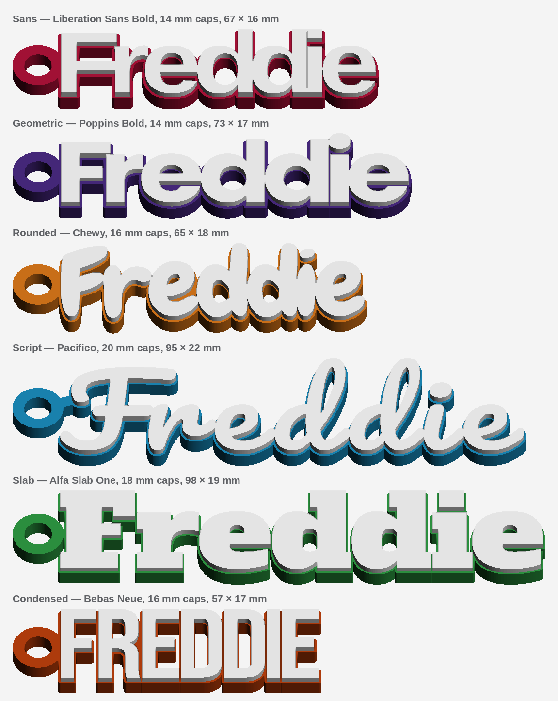

Six plain faces to set a name in, and forty-two display faces for when the
name wants to be a thing rather than a label.

Two of the newer ones are worth knowing before you pick by eye.  The stencil
faces measure as well as the plain sans -- 10 mm, all three -- because a
stencil breaks the wall of every counter, and the weld that shuts a normal
face's `a` cannot close a bay that is already open to the outside.  The fat
comic faces measure worst in the whole set, Titan One at 24 mm, which is the
opposite of what they look like: weight is not what keeps a counter open, the
ratio of counter to stroke is, and a face drawn with a very fat marker has
small counters by construction.

### Plain

| Face | Set in | Wants | What it is |
|---|---|---|---|
| Sans | Liberation Sans Bold | 10 mm | Plain and heavy. The one that fits any name and any length. |
| Geometric | Poppins Bold | 12 mm | Circular bowls and a single-storey a — the widest counters here, and the one that holds up smallest after the sans. |
| Rounded | Chewy | 16 mm | Soft and bouncy, drawn with a fat marker. Latin-1 only, so no Polish or Turkish accents. |
| Script | Pacifico | 20 mm | A brush script. The letters run into each other before the weld is asked to do anything, which is what a name keyring usually wants — but its lower case is small for its capitals, so it is the face that needs the most height. |
| Slab | Alfa Slab One | 18 mm | Fat slab serifs, heavy enough that the weld is barely needed. Its counters are slots rather than holes, so it wants a tall letter to keep them open. |
| Condensed | Bebas Neue | 16 mm | Tall narrow capitals — lower case comes out as capitals too. The one for a long name, at about two thirds the width. |

### Blackletter

| Face | Set in | Wants | What it is |
|---|---|---|---|
| Fraktur | UnifrakturMaguntia | 12 mm | Broken-stroke blackletter, the Mainz kind, with a hairline on every curve. Holds up better than it looks. Latin-1 only. |
| Schwabacher | UnifrakturCook Bold | 17 mm | Heavier blackletter with a rounder bowl. The extra weight costs height: it wants 17 mm before its counters come back. Latin-1 only. |
| Pirate | Pirata One | 12 mm | A single-weight blackletter drawn tighter than the others — the gothic that sets smallest, and the one for a long name. |
| Rocker | New Rocker | 13 mm | Blackletter with the corners knocked off, halfway to a band logo. Softer than the fraktur and about as small. |
| Medieval | MedievalSharp | 10 mm | A sharp-nibbed medieval hand, and the surprise of the set: it measures as well as the plain sans, 10 mm with its counters still holes. |

### Ornate

| Face | Set in | Wants | What it is |
|---|---|---|---|
| Quill | Eagle Lake | 12 mm | Pointed-pen calligraphy with a swelling stroke and a long tail on half the letters. |
| Uncial | Uncial Antiqua | 15 mm | Round uncial capitals, the shape of an illuminated manuscript. Wide, so a long name runs on. |
| Almendra | Almendra Display | 10 mm | An ornate old-style with fine serifs and a swash on the capitals. Sets at 10 mm despite the detail. Latin-1 only. |
| Filigree | Astloch | 11 mm | Thin gothic filigree, hairlines throughout. Its counters hold open from 11 mm, but the strokes are so fine that the weld is most of what you actually print, and the letters run together long before they close up — one for a short name. Latin-1 only. |
| Tattoo | Miltonian Tattoo | 26 mm | Fine ornamental tattoo lettering. It never comes back quite clean — a couple of counters close at every height the slider reaches, which is why it starts at the top — but a couple is all it loses. Latin-1 only. |
| Emblem | Emblema One | 10 mm | Heavy inline capitals. Fat enough that the weld is barely needed, and it still sets at 10 mm — the best of the complicated ones on a small keyring. |
| Nouveau | Federant | 10 mm | Art-nouveau capitals with a flick on every terminal. Latin-1 only. |
| Roman | Cinzel Decorative | 10 mm | Classical Roman capitals with a swash and a leaf on the terminals, the lettering off a monument. 10 mm. |

### Western

| Face | Set in | Wants | What it is |
|---|---|---|---|
| Western | Rye | 26 mm | Wood-type western: heavy slabs with an inline down each stroke. The inline is a counter, and the weld shuts it at every height here — by far the most of anything in the set — so what prints is the solid letter inside the outline rather than the inlined one. Latin-1 only. |
| Saloon | Sancreek | 22 mm | Spurred western display, all barbs and brackets. Wants 22 mm before it reads as letters rather than as fencing. |
| Caesar | Caesar Dressing | 14 mm | Roughly chiselled Roman capitals, as though cut with a blunt tool. 14 mm, the same as the sans's own default. Latin-1 only. |
| Stone | Piedra | 20 mm | Letters drawn as cut stone with a crack through each one. The cracks are counters, so it wants 20 mm to keep them. Latin-1 only. |
| Varsity | Graduate | 10 mm | Collegiate slab, the letter off an American jacket. The one face in this group that sets at 10 mm — the rest of the western faces are inlined or spurred and pay for it. |

### Horror

| Face | Set in | Wants | What it is |
|---|---|---|---|
| Drip | Nosifer | 12 mm | Heavy capitals with the paint running off the bottom. The drips are separate pieces and the weld catches them, which is exactly what the weld is for. |
| Bones | Butcherman | 26 mm | Scratched horror capitals drawn as loose strokes, so its counters are gaps rather than holes. It loses a dozen of them even at the top of the slider, and more than twice that at 10 mm. |
| Creep | Creepster | 22 mm | Lumpy horror lettering with a dripping crossbar. 22 mm and the bowls come back. Latin-1 only. |
| Metal | Metal Mania | 26 mm | Spiky metal-band lettering drawn as a great many small pieces, and the slowest of the set to build. Four counters shut whatever the height, which is what keeps its floor at the top. Latin-1 only. |

### Dimensional

| Face | Set in | Wants | What it is |
|---|---|---|---|
| Neon | Monoton | 26 mm | Four parallel lines to a stroke, like a neon tube. The tubes do survive at the top of the slider — wind the weld back to 0.35 and nothing closes at all — but under 26 mm the weld fills between them and the letter goes solid. |
| Shadow | Vast Shadow | 10 mm | A fat slab with a cast shadow behind it. The shadow is a second piece per letter, so the word comes out in more pieces than it has letters and the bridges do more work than usual — but the counters themselves are fine, and it sets at 10 mm. Latin-1 only. |
| Bevel | Bungee Shade | 26 mm | Three-dimensional block capitals with an extruded side. The extrusion reads at the top of the slider, at the cost of about eight counters; below that it fills in and what is left is the plain block. |
### Comic

| Face | Set in | Wants | What it is |
|---|---|---|---|
| Comic | Bangers | 21 mm | Brush-drawn comic lettering on a slant, the sound-effect face. Heavy, but its counters are small for the weight, so it wants 21 mm — more than most of the ornate faces do. |
| Titan | Titan One | 24 mm | Fat rounded poster capitals with almost no daylight in them. The hungriest face here: 24 mm before its bowls survive the weld, so it is one for a short name set large. Latin-1 only. |
| Lucky | Luckiest Guy | 22 mm | Comic-book capitals, the ones on the cover rather than in the speech bubble. 22 mm, for the same reason as Titan One. |
| Chunky | Bowlby One | 13 mm | Heavy grotesque with round bowls, and the one comic face that sets small — 13 mm, because its counters stayed holes instead of narrowing to slots. The pick of the group for a keyring. Latin-1 only. |
| Marker | Permanent Marker | 18 mm | Felt-tip handwriting with a dry edge to every stroke. The letters lean into each other before the weld is asked for anything, the way the script does. Latin-1 only. |

### Stencil

| Face | Set in | Wants | What it is |
|---|---|---|---|
| Stencil | Stardos Stencil | 10 mm | A serif cut into stencil strips. Ties the plain sans at 10 mm, the best in the set outside Plain, because a broken counter is open to the outside and the weld cannot close it. Its breaks are fine, though, so they read better on the stencil plate than on a small keyring. Latin-1 only. |
| Spray | Saira Stencil One | 10 mm | Heavier stencil with wide breaks you can see at any size — the one to pick if you want the stencil to read as a stencil. 10 mm, on the same trick. |
| Military | Black Ops One | 10 mm | Stencilled military slab, the kind sprayed on a crate. Fat enough that the weld is barely needed and broken enough that it would not matter: 10 mm. |

### Retro

| Face | Set in | Wants | What it is |
|---|---|---|---|
| Retro | Lobster | 18 mm | The retro sign script, bold and connected. Runs together on its own like Pacifico but with tighter counters, so it needs 18 mm rather than 20. |
| Deco | Righteous | 13 mm | Geometric deco capitals with clipped corners. 13 mm, and one of the few display faces that stays legible at the bottom of the slider. |
| Marquee | Limelight | 10 mm | High-contrast deco display, the lettering on a theatre front. Sets at 10 mm despite the hairlines, because what it has instead of small counters is large ones. |
| Groovy | Shrikhand | 16 mm | Heavy slanted display with a seventies bulge to every curve. 16 mm. |
| Racing | Racing Sans One | 11 mm | Italic speed-lettering off the side of a car. The slant means no two letters meet square, which is exactly the case the negative gap is for. 11 mm. |

### Tech

| Face | Set in | Wants | What it is |
|---|---|---|---|
| Orbit | Orbitron | 10 mm | Wide geometric science-fiction capitals. Shipped as the variable font Google publishes, unmodified, so what you get is its regular weight — which measured better than a heavy instance of it did, 10 mm against 12. Latin-1 only. |
| Techno | Audiowide | 10 mm | Rounded techno capitals with a slot cut in the heavy strokes. 10 mm. |
| Arcade | Press Start 2P | 11 mm | An eight-bit face, every stroke a whole number of pixels wide. Its counters are square, and a square shrinks evenly where a round bowl pinches at the ends, which is why a face made of blocks measures better than the fat ones do — 11 mm. Sets wide: a long name runs on. |
| Pixel | Silkscreen | 10 mm | A smaller, tighter pixel face than the arcade one, drawn for a screen that did not have many. 10 mm. Latin-1 only. |

The **wants** column is the thing to take seriously, and it is measured rather
than opinion.  The weld that makes a word one piece shrinks every counter --
the hole in an a, e or o -- by about twice its own width, and a hole left
narrower than a nozzle is filled in, because that is what the slicer would do
with it anyway.  A face whose counters are slots rather than holes therefore
has them welded shut at a height where the sans is still perfectly readable:
Alfa Slab One at 14 mm is a row of blobs, and Pacifico's lower case is small
for its capitals, so it needs the most height of the plain six.

`src/measure_faces.py` is where that number comes from.  It sets eight awkward
names -- Mia, Abbey, Freddie, Oscar, Noah, Sophie, Gigi, Benjamin -- in a face
at every height from 10 to 26 mm and every weld from 0.5 down to 0.35, and
counts the counters that closed; the floor is the shortest height where none
of them did.  Run it over the six plain faces and it gives back the floors
they were given by eye, which is the only reason to believe it about a face
nobody has looked at:

```
python3 src/measure_faces.py                  # every bundled face
python3 src/measure_faces.py -v slab          # with the whole grid
python3 src/measure_faces.py src/fonts/Your.ttf   # one not in FACES yet
```

The other two numbers a face carries, its weld and its letter spacing, are not
measured, and the code says so.  Both were put through the same sweep and
neither moves anything countable -- across the six plain faces, taking the gap
from -0.15 to +0.4 mm changes the counters that close not at all and the
bridges by at most one.  What they change is how the word reads, which is a
judgment.  They are banded from how heavy a face's stem is and how narrow its
letters are, and then left to the eye.

Six of the display faces -- Tattoo, Western, Bones, Metal, Neon and Bevel --
have a floor of 26 mm, the top of the slider.  That is the sweep saying there
is no letter height at which *every* counter stays open, and it is a true
thing about a face drawn as four parallel lines or as a letter plus its own
cast shadow.  How much it costs varies a lot and the table says which: Rye
loses its inline on every letter, Miltonian Tattoo loses two counters in the
whole sweep.  They are kept because the readout tells you what closed, and
because the stencil cuts them straight through a plate where none of this
applies -- a face too fine to weld into a solid word is often the best thing
to cut.

### The picker is the specimen sheet

Every face's name in the picker is set in that face, so the list shows you what
it is choosing between rather than describing it.  Forty-eight typefaces all
written in one typeface is a list of words; written in themselves it is a
specimen sheet, and you pick Fraktur because the word is sitting there in
blackletter.

A face only ever has to spell its own name there, and that is all of it that
ships: `src/gen_specimens.py` subsets each TTF to the couple of dozen
characters in its own label, encodes it as woff2 and writes it into
`public/index.html` as a data URI.  Forty-eight faces come to about 141 KB
that way against 5.3 MB for the files themselves, which is what makes this possible
at all -- and because it is inline, the page is still one static file with
nothing new to serve.  It does cost: the page goes from 25 KB gzipped to about
120 KB, nearly all of it font data that is already compressed.

```
python3 src/gen_specimens.py          # rewrite the block after adding a face
python3 src/gen_specimens.py --check  # fails if it is out of date
```

Two things keep the list a list.  `size-adjust` scales each face so its
capitals match the interface font's, because Bebas Neue and Alfa Slab One at
the same pixel size are nothing like the same size to look at; and the ascent
and descent are overridden to the same values for all of them, so a face with
tall accents cannot shove its neighbours down the page.  What it cannot fix is
weight: Astloch and Almendra Display are hairlines, and they look like
hairlines at 16 px.

The open list is drawn by the platform on Safari and on both phones, and those
ignore a `font-family` on an `<option>`.  So the shut control is set in the
face it is showing as well -- that rule is honoured everywhere, and it is the
half of the effect nobody misses out on.

Picking a face moves the letter-height slider to that floor.  You can drag it
back down -- nothing here refuses -- and the readout will tell you how many
counters filled in when you do.

The faces ship in `src/fonts` beside the code, so the same forty-eight are
there on your machine and on Vercel, which has no system fonts at all.  Chewy,
Luckiest Guy and Permanent Marker are under the Apache Licence 2.0 and
everything else under the SIL Open Font Licence: those three and the five
original ones each have their own licence file, and the forty OFL display
faces share `LICENSE-Complicated.txt`, which carries the licence text once and
all forty copyright lines.  `--font
path/to/Your.ttf` from the command line takes any other TTF, with `CAP` and
`WELD` as its defaults, since nothing has been measured for it.

## Printing them

They print **letters up**, flat on their backs, no supports and no brim worth
bothering with.  The filament change is at the top of the body, so a
single-nozzle printer gets the two-colour version for one pause.

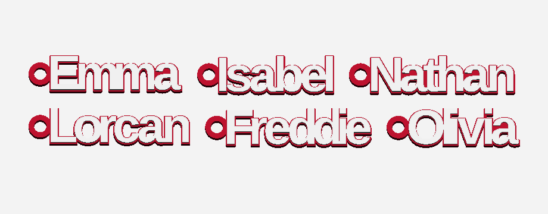

The batch box takes one name per line and lays the lot out on a plate, which is
what makes these worth doing at all: a class list or a party's worth of them is
one plate and one print.

Two things the readout will tell you and you should believe:

- **Counters.**  In the sans at 14 mm caps the hole in an a is about 1.1 mm
  across, and the weld has already eaten into it.  Under a millimetre the
  slicer starts bridging it and the letter fills in, so the answer is a taller
  letter, not a finer nozzle.  Counters that have gone altogether are counted
  separately and named as such: that is the one that makes a name unreadable
  rather than merely tight.
- **Bridges.**  A name that needed three of them is a name where the font left
  a lot floating; it will print, but look at the preview before you commit a
  plate of them.

## From a terminal

```
python3 src/gen_cards.py --kind name --name "Freddie"
```

writes `stl/freddie_keyring.3mf` and `.stl`.  `--font script` (or any of the
[forty-eight faces](#the-forty-eight-faces), or a path to a TTF of your own)
for the face, `--cap 20` for bigger letters, `--ring 0` for no tab, `--flat`
for the single-colour version, `--rise` for how proud the letters sit,
`--colours "#2fbf3f,,#ffffff"` for the two colours, and `--batch names.txt`
for a plate of them -- the whole plate in one face.

---

# Sign enclosures

A shallow box with the word lit through its own face: a name over a door, a
room number, an OPEN sign for a counter.  An LED strip goes inside, the lead
comes out of a notch in the bottom wall, and the letters are the only thing the
light gets out through.


## The face is three things, and all of them print first

Laid face down on the plate, the first two millimetres of the print are the
whole of the idea:

1. an **opaque layer**, 0.8 mm of it, with the letters taken clean out;
2. the **letters**, filled back in flush in a translucent filament -- the same
   inlay a fob's lettering is, and the same three layers;
3. a **diffuser**, a translucent sheet across the entire inside of the face,
   which is what turns a row of LEDs into an evenly lit word rather than a row
   of bright spots with the word round them.

Everything above that is one filament and four walls.  So the colour changes
all happen in the first eight layers, and the rest of the box prints as a box.

The diffuser earns its place twice.  Cut an O out of an opaque face and the
middle of the O is an island -- [the stencil's problem](#stencils), which that
one solves with bridges.  Here the sheet behind the face is printed straight
over every island and welds it on, so the counters stay where the type designer
put them and **there is nothing to bridge**: the middle of the O is held by the
diffuser, and it is lit through it too.  That is also why the diffuser cannot be
set to 0; ask for it and the generator says no rather than handing you a face
whose counters fall out on the bed.

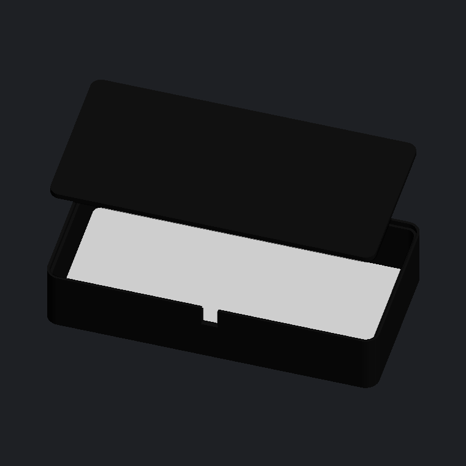

## The box

| | |
|---|---|
| Face | 120 x 60 mm by default, any size you like |
| Depth | 24 mm, of which 20.4 mm is clear air for the strip |
| Face sandwich | 0.8 mm opaque over 0.8 mm of diffuser |
| Walls | 2 mm -- five lines of a 0.4 mm nozzle, stiff enough to hold the lid and opaque enough to keep the light in |
| Margin | 10 mm round the lettering, and never less than the wall plus 1 mm: a letter out there would be cut into the wall, where nothing lights it and nothing holds it |
| Lid | a 2 mm plate that drops into a rebate in the back and stops flush on the ledge it leaves, 0.2 mm clearance all round |
| Cable notch | 6 mm square in the back edge of the bottom wall |
| Corners | Ø5 mm, with a 0.8 mm chamfer on the front outer edge -- the edge you see |
| Wall mount | none by default; two tape pads or two screw posts, both part of the case |

The lid is a **friction fit**, not a snap: a printed snap at this size is a
thing that breaks off in your hand the second time you open it, and a lid you
can get off again is what lets you replace the strip.  Tight to get on is what
`--clearance` is for.  It prints inside face down, because the plate side of a
print is the flat one and a strip's adhesive wants a flat one.

The notch for the lead is cut a lid deeper than it looks, so the cable passes
*under* a lid that stays whole -- which holds the cable in and keeps the light
off the wall behind.  `--cable 0` closes the wall for a battery inside.

Two numbers the readout gives you and you should believe:

- **The clear air inside.**  Depth less the face and the lid: how far the light
  has to spread before it reaches the diffuser.  Under about 12 mm a single row
  of LEDs reads as a row of LEDs through the letters, and the readout says so.
- **The narrowest stroke.**  What is lit is the stroke, so a hairline face gives
  you a hairline of light.  Under 0.8 mm it stops being a stroke and starts
  being a smear of translucent filament.

An SVG goes in instead of the words and is lit exactly the way they are -- a
logo, a house number, an arrow.  Flat fills only, as everywhere else here.

## Getting it on the wall

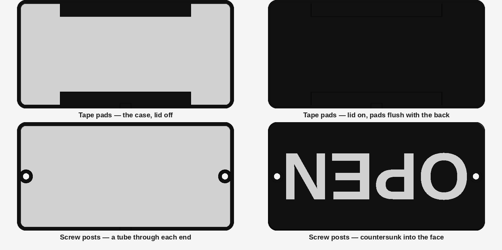

The back of this box is a lid held in by friction, which makes the obvious
place to put a mount the wrong one.  Stick foam tape to the lid and the tape is
holding the *lid*: the case pulls off it and leaves the back stuck to the wall
with the strip still on it.  A screw through the lid is the same story with
more steps.

So neither mount here touches the lid.  Both are a post that rises off the
inside of the front face, comes up through a hole in the lid, and finishes
flush with the back -- the load goes into the case, and the lid still lifts off
to get at the strip.  The post runs a half millimetre *into* the wall on
purpose rather than standing a hair clear of it: a gap that narrow is too fine
to print and comes out as a smeared join anyway, so it is merged and the wall
carries the load with it.

Nothing is lost to them.  The front face is opaque everywhere except where the
letters are cut out, so a post behind it cannot be seen; and both mounts live
in the dead ring between the wall and the margin the artwork is fitted inside,
so neither casts a shadow on a letter.  Where the post comes through, the
diffuser gives way to it -- a post standing on the sheet would be holding the
sign up by 0.8 mm of translucent filament.

**Tape pads** are two strips, top and bottom, 60% of the width and as deep as
the margin leaves.  Foam tape goes on the pads; they are the case, so the sign
is.

**Screw posts** are a tube through each end on the centre line, the hole
countersunk into the face so the screw goes in from the front and its head
finishes below the surface.  That puts two screw heads on the face, out in the
plain border and well clear of the lettering, and it is the price of a mount
that holds the case rather than the lid.  What it buys is a sign that goes up
and comes down with the lid on and the strip undisturbed.  Sized for an M3
woodscrew, which is more than a box this light needs.

Both want room between the wall and the lettering, and both say so rather than
squeezing: at the default 10 mm margin there are 8 mm to play with, a tape pad
takes 7 of them and a screw post 7, and a margin too tight for the one suggests
the other.

## Printing them

Face down, no supports, and two filaments: something opaque for the case and
the lid, something translucent or white for the letters and the diffuser, which
are one piece and are the only thing that has to pass light.  The 3MF comes out
with the two as separate components, so the slicer opens it knowing which is
which.

The face wants a multi-material printer -- an AMS, an MMU, two tools, whatever
you have -- because the opaque layer and the letters share the same eight
layers, which is not something a filament change partway up can do.  With one
extruder the honest options are to print the whole thing in the translucent
filament and let the face glow all over, or to print it opaque and accept that
the letters are the same colour as everything else.

The lid and the case go on one plate, both flat, and neither needs a brim.  The
batch box takes one sign per line -- a room name each, all the same size.

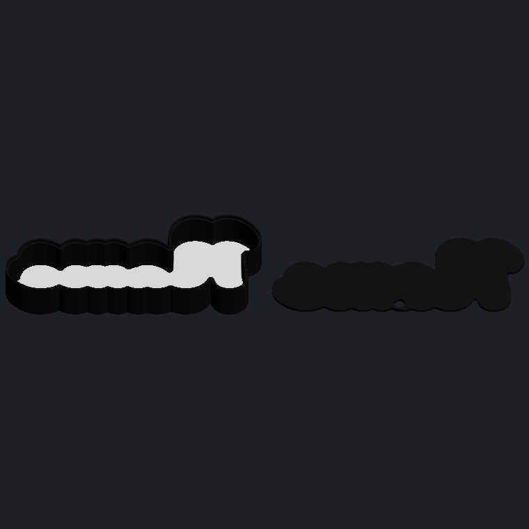

## From a terminal

```
python3 src/gen_cards.py --kind sign --name "OPEN"
```

writes `stl/open_sign.3mf` and an STL for each part.  `--size 160x70` for the
face, `--depth` for how deep the box is, `--wall`, `--diffuse` for the sheet
behind the face, `--margin` for the border round the lettering, `--cable 0` to
close the bottom wall, `--no-lid` to leave the back open, `--font condensed`
(or any of the [twenty-nine faces](#the-twenty-nine-faces), or a path to a TTF),
and `--design logo.svg` to light artwork instead of words.  `--batch rooms.txt`
puts a set of them on one plate, and `--preview` renders the PNGs above.

---

# Stencils

A rectangle you give the size of, with the words -- or an SVG -- cut clean
through it, to paint or spray through.


The problem is the [name keyring's](#name-keyrings), backwards.  A keyring has
to make **one solid out of the several a word is**; a stencil has to keep one
plate in one piece while taking that same word *out* of it.  Cut an O through a
plate and the middle of the O is a loose disc: it drops out on the print bed,
or it prints attached to nothing and comes off in the bag.  The counter of an
A, the eye of an e, the middle of any ring in an SVG -- every one of them is an
island the moment the cut goes through.

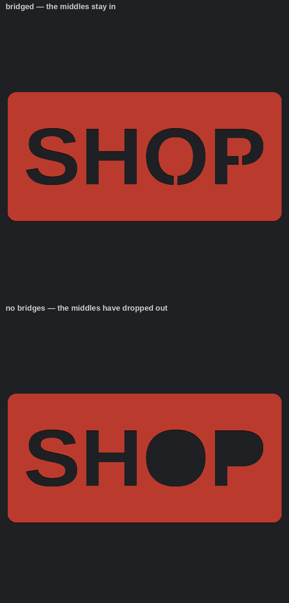

So each island is found and tied back with a **bridge**: a bar of plate left
uncut across the shortest crossing between the island and whatever is already
anchored.  It is the little interruption in every road-marking and mailbox
stencil, and it is not a flaw in them -- it is the only reason the letters
still have middles.  Nesting comes out on its own: the largest loose piece is
tied first, and once it is anchored it can hold the next one in.  Set the
bridges to 0 and nothing is tied; the islands come off the plate as loose
pieces, which is what you want only if you are placing them by hand.

An SVG goes through the same mill, and every fill in it is one hole whatever
colour it was drawn in -- a stencil has no colours to sort them into.  What it
does have is the same island problem, and the same answer:

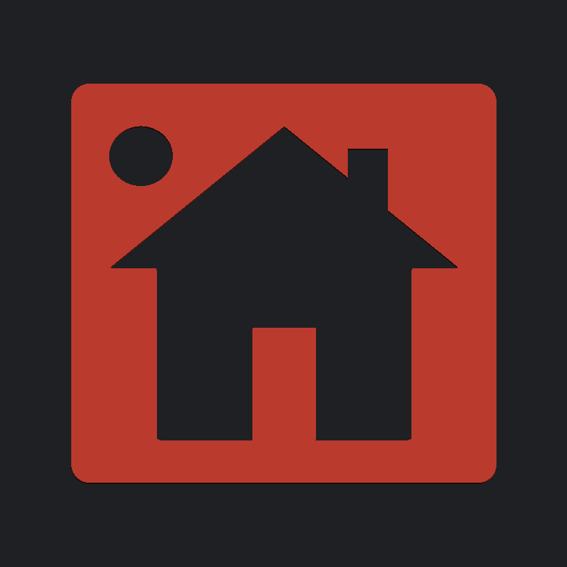

| | |
|---|---|
| Plate | 120 x 60 mm by default, any size you like |
| Thickness | 0.8 mm -- four layers at 0.2, and still stiff enough to peel off in one piece |
| Margin | 8 mm of plate round the cut; the artwork fills what is left.  It never goes under 0.2 mm -- artwork laid exactly on the edge meets it at a point, and a boundary that touches itself does not close |
| Bridges | 1.6 mm, four lines of a 0.4 mm nozzle; 0 leaves the islands loose |
| Corners | Ø4 mm, because a square corner on a thin plate catches and tears |

Thin is the point.  Every millimetre of thickness is a millimetre of wall the
paint has to reach round, which is what blurs an edge, so the default is as thin
as will still peel off a wet wall in one piece.

Two numbers the readout gives you and you should believe:

- **The narrowest cut.**  That is the thinnest part of the letter you are
  painting, and a cut narrower than a nozzle will not print open however
  carefully it was drawn.  The answer is a bigger plate or a heavier face, not
  a finer nozzle.
- **The narrowest plate.**  The smallest gap between two cuts, or between a cut
  and the outside edge -- measured as a distance rather than guessed at from a
  stroke width, because that sliver between the L and the A is what tears
  first.  Under 0.8 mm it will not survive being washed.

## Printing them

Flat on the plate, no supports, and no brim unless the bed is cold: a stencil
is one thin layer of outline and infill and it prints in minutes.  The batch
box takes one word per line and lays the lot out, which is what makes a set of
them worth doing -- a name per drawer, or a number per bin.

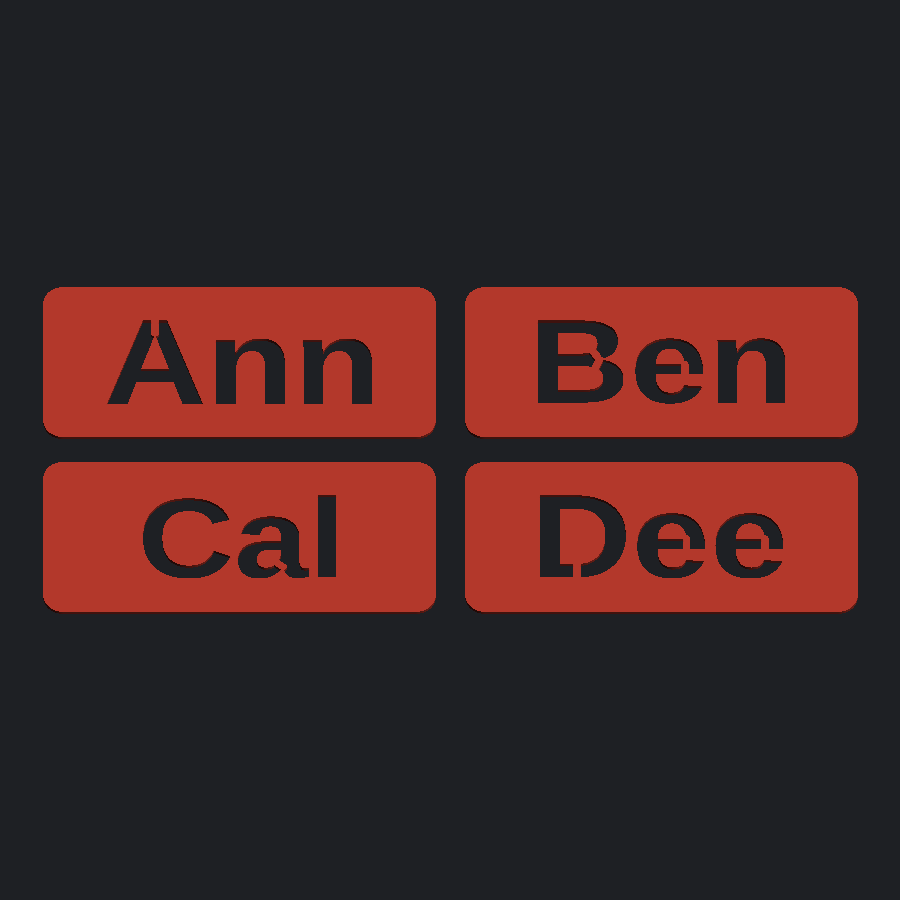

## From a terminal

```
python3 src/gen_cards.py --kind stencil --name "SHOP"
```

writes `stl/shop_stencil.3mf` and `.stl`.  `--size 160x50` for the plate,
`--margin` for the frame round the cut, `--bridge 0` to leave the islands
loose, `--thick` for the plate, `--font condensed` (or any of the
[forty-eight faces](#the-forty-eight-faces), or a path to a TTF) for how it is set, and
`--design arrow.svg` to cut artwork instead of words.  `--batch words.txt`
puts a set of them on one plate.

---

# Car-brand valve caps

Schrader valve stem caps with a car maker's emblem on top. Twelve marks so
far, all off the same parametric cap body.

| | |
|---|---|
|  |  |

## The caps

The **flat top** is the main one: Ø14.0 × 13.1 mm, knurled, flat face with the
emblem raised 0.6 mm so a single filament change prints the logo in a second
colour.

All are `stl/<brand>_valve_cap_flat_top.stl`:

| Brand | Emblem width | Narrowest stroke | Narrowest gap |
|---|---|---|---|
| honda | 11.9 mm | 0.59 mm | 1.52 mm |
| bmw | 13.1 mm | 1.01 mm | 2.09 mm |
| mercedes | 13.1 mm | 0.75 mm | 2.09 mm |
| toyota | 13.1 mm | 0.57 mm | 0.42 mm |
| audi | 13.1 mm | 0.56 mm | 2.09 mm |
| volkswagen | 13.1 mm | 0.59 mm | 2.09 mm |
| jeep | 13.1 mm | 0.55 mm | 0.41 mm |
| chevrolet | 12.8 mm | solid | — |
| mitsubishi | 9.9 mm | solid | 0.71 mm |
| volvo | 9.2 mm | 0.56 mm | 1.52 mm |
| ford | 13.1 mm | solid | 0.46 mm |
| ford_script | 20.6 mm | solid | 0.29 mm |

`ford_script` is the only one on a **Ø22 mm body** rather than Ø14 — the real
script does not survive a smaller cap, see below. Same thread, same height.

Chevrolet and Mitsubishi are solid shapes rather than outlines, so "narrowest
stroke" doesn't apply — their only fine detail is the pointed corners, which
round off by about a nozzle width and look fine for it. Ford is inverted: the
raised part is the whole oval and the *letters* are the gaps, so its 0.46 mm
figure is the width of the lettering.

Emblem widths differ because what actually constrains the mark is the *radius*
of the flat face (6.65 mm), not its width. Honda's wide rounded rectangle hits
that limit at the corners; Mitsubishi and Volvo look narrow in the table but
reach the same 6.55 mm radius, because their widest points aren't horizontally
opposed. `logos.fit_width(name, 6.55)` computes the number for a new mark.

Two more shapes exist for Honda:

| STL | Size (mm) | What it is |
|---|---|---|
| `stl/honda_valve_cap_flat_top_engraved.stl` | Ø14.0 × 12.5 | Same cap with the emblem **recessed 0.5 mm** — for paint fill, or a subtler look. |
| `stl/honda_valve_cap_badge.stl` | 15.0 × 12.2 × 13.2 | Ø11.6 knurled body flaring into an **emblem-shaped badge plate** with the logo raised on it. |

The badge shape only earns its keep when the mark has a distinctive silhouette.
For a circular logo the plate is just a circle, which is the flat top with extra
steps — so BMW and Mercedes don't get one.

`previews/` has an isometric, a top-down and a cutaway render of each.

## About the emblems

Honda is traced from the supplied `honda_logo.glb`. The rest are built from
primitives in `src/logos.py` — circles, ellipses, wedges, bars and mitred
polylines — which is both easier and better than tracing a mesh: the symmetry
is exact, and every stroke width is a number you can turn up until it prints.

Deliberate departures from the real marks, all of them forced by the 0.4 mm
nozzle at this size:

- **BMW** has no lettering in the outer band — at 13 mm across it would be
  under a millimetre tall, a smear rather than text. The raised parts are the
  band plus two diagonally opposite quarters, so the filament change gives you
  the quartered roundel rather than a flat outline.
- **Toyota**'s inner T sits further off the outer ellipse than in the real
  logo, opening the tightest gap from 0.24 mm to 0.42 mm.
- **Audi**'s rings are drawn noticeably heavier. Correct proportions put the
  stroke at 0.28 mm, which nothing will hold; these are 0.56 mm.
- **Volkswagen**'s W sits lower than in the real mark, to keep a printable gap
  under the point of the V.
- **Volvo** is the iron mark only — the ring and arrow, no wordmark band.
- **Jeep** is the seven-slot grille and headlights, not the wordmark.
- **Ford** comes in two versions — see below.

### The two Fords

Both are built inside out from the other marks. Rather than lettering standing
proud of the cap, the whole oval is raised and the letters are cut *through* it
down to the flat top face. A filament change at that height gives a coloured
oval with the letters in the body colour, which is how the badge really reads —
and it replaces fragile standing letters with one solid pad.

**`ford`** — block capitals, Ø14 mm cap, 0.46 mm letters. Prints on a 0.4 mm
nozzle like everything else here.

**`ford_script`** — the real Ford script and oval rings, traced from the actual
logo artwork, on a Ø22 mm cap.

The size difference is not a stylistic choice. The script is a copperplate hand
whose upstrokes are hairlines. Measured on the real outline at a 13.1 mm oval:

| | median channel | under 0.40 mm |
|---|---|---|
| script at 13.1 mm oval | 0.19 mm | 95% of the lettering |

That is half a nozzle width. Fattening it does not rescue it either — widening
the channels to a printable 0.45 mm starves the pad *between* the strokes down
to 0.09 mm, so you trade one unprintable feature for the other. The only thing
that helps is diameter, and the cap has to grow a long way:

| Oval | Cap | Channel | Pad between | Verdict |
|---|---|---|---|---|
| 13.1 mm | Ø14 | 0.19 mm | 0.21 mm | will not resolve at all |
| 20.6 mm | Ø22 | 0.29 mm | 0.33 mm | **shipped** — needs a 0.25 mm nozzle |
| 28 mm | Ø30 | 0.41 mm | 0.45 mm | works on 0.4 mm, but that's a jar lid |

So `ford_script` needs a **0.25 mm nozzle or finer**, at 0.1 mm layers. On a
0.4 mm nozzle the script will fill in and you'll get a plain raised oval — use
`ford` instead. If you want the 0.4 mm-nozzle version anyway, set `od` and
`EMBLEM_W` for `ford_script` to the bottom row and re-run; nothing else needs
to change, the thread stays the same.

### Tracing lettering

Two tracers feed these:

- `src/trace_svg.py` takes an SVG logo. Subpaths are combined under the even-odd
  rule — which is just an XOR of them, so arbitrarily nested rings come out
  right (Ford's oval is four deep: rim, white ring, navy field, lettering). It
  emits a solid `pad` and the `cuts` knocked out of it, which is exactly what
  `PADS` wants.
- `src/trace_text.py` takes a string and a TTF and pulls glyph outlines straight
  out of the font with fontTools, flattening the curves rather than rasterising
  and re-tracing. `src/ford_wordmark.json` is "FORD" in Outfit Bold (SIL OFL),
  picked because it measured widest of the fonts to hand at the size that fits.

```
python3 src/trace_svg.py logo.svg src/ford_script.json
python3 src/trace_text.py FORD /path/to/Font.ttf src/ford_wordmark.json
```

## The thread

The bore is the real **Schrader valve stem thread: 0.305"-32 UNS** (what's on a
TR413 and every other standard car/truck rubber snap-in stem):

- major Ø 7.747 mm, pitch 0.79375 mm (32 TPI), 60° UN profile
- cut with a uniform **0.15 mm radial clearance**, so the cap's thread crests
  sit at Ø7.19 and its roots at Ø8.05
- ~9 mm of engagement (≈11 turns) plus a 45° lead-in chamfer at the mouth

If it binds on your printer, raise `THREAD_CLEARANCE` in `src/generate.py` to
0.20 and re-run. If it's sloppy, drop it to 0.10.

> These are decorative caps, not sealing caps. The valve core holds the air;
> a cap keeps dirt out. Don't rely on it for pressure.

## Printing

**Orientation:** logo face **down on the build plate**, open threaded end up.
No supports needed either way, but face-down gives the crispest logo — the
0.6 mm-wide bars get the build-plate finish instead of being 4 thin top layers.
Flipping it (emblem up) is also fine and looks better if you care more about
the knurling.

**Settings**

- Layer height **0.12–0.15 mm**. The thread pitch is only 0.794 mm, so 0.2 mm
  layers give you ~4 layers per turn and a mushy thread.
- 3–4 perimeters, 25%+ infill. Each cap is ~1.1–1.4 cm³, so it's a few minutes
  and a gram of filament.
- 0.4 mm nozzle is fine, but enable thin-wall / "detect thin walls" so the
  slicer doesn't drop the narrow strokes — see the table above for the
  narrowest one in each mark (0.57 mm at worst).

**Material:** PETG, ASA or nylon. A wheel well in summer sun gets well past
PLA's softening point, and PLA also goes brittle with UV — it'll crack and you
lose the cap. ASA is the nicest of the three outdoors.

**Two colours without a multi-material printer:** insert a filament change at
**Z = 12.50 mm** — every cap here puts its top face at exactly that height —
and everything above it, the raised emblem, prints in the second colour.
Printing logo-face-down instead, start in the emblem colour and change at
Z = 0.60 mm (flat top) / 0.70 mm (badge). To get the whole top disc in the
second colour rather than just the logo, print emblem-up and move the change
down a millimetre or so.

For the engraved version, print it in one colour and wipe acrylic paint or a
paint pen into the recess, then scrape the top flat with a card once it skins over.

## Regenerating

```
pip install numpy trimesh manifold3d shapely mapbox_earcut networkx pillow scipy
python3 src/generate.py     # writes stl/
python3 src/render.py       # writes previews/
```

Everything is driven by the constants at the top of `src/generate.py` — cap
diameter, height, flute count and depth, per-brand emblem width, how far the
logo stands proud, thread clearance. `BUILDS` lists which brand/variant pairs
get written; any brand can use any variant. Change and re-run; the whole set
takes about ten seconds.

`src/logo_outline.json` is the Honda silhouette (exterior ring + 4 holes)
pulled out of the source `.glb` by `src/extract_outline.py`. The `.glb` itself
isn't committed (it's a 7 MB third-party model); to regenerate the outline:

```
python3 src/extract_outline.py path/to/honda_logo.glb
```

### Adding a brand

Write a builder in `src/logos.py` returning a list of shapely polygons — the
strokes of the mark — normalised to an overall width of 2.0, register it in
`LOGOS`, add a width to `EMBLEM_W` and a line to `BUILDS`.

Three things that bite:

- Return the strokes *separately* rather than pre-unioning them. A shapely
  union of touching strokes is "valid", but its boundary touches itself where
  they meet and extruding that gives a non-watertight mesh. `generate.py`
  extrudes each stroke and lets the boolean engine weld them, which is robust.
- Where a stroke meets a ring, run it **past** the outer edge and clip it back
  with `.intersection(disc)`. Ending it inside the ring instead leaves a
  hairline sliver along the ring's inner edge.
- Cutting one primitive with another can leave a duplicate vertex where the cut
  crosses an axis, which earcut turns into a degenerate triangle. `_dedupe()`
  in `load()` catches it, and `emblem_prisms()` fails loudly if one slips
  through.

`build_flat()` checks the emblem fits inside the flat face and refuses to emit
a cap if not.

Marks built from lettering or fine illustration — Nissan's wordmark, Subaru's
star cluster, any of the crests — aren't worth constructing by hand. Trace them
instead: `src/trace_svg.py` from an SVG, `src/extract_outline.py` from a `.glb`.
Check the measured stroke width before committing to a cap size; Ford above is
the cautionary tale.

These are manufacturer trademarks — caps for your own car, not for selling.


---

# Phone cases

A case for any of eighteen iPhones, written straight to multi-tool g-code,
with an SVG painted onto the outside of the back by the AMS -- or as a 3MF
that keeps the colours, or an STL if you only want the shape. Its own page in the app, at
**[/case](/case)**; from a terminal, `python3 src/case_app.py`.

This one does not look like the rest of the repository, and it is worth
knowing why before reading the code.

- **It is g-code, not a solid.** Nothing here builds a mesh and hands it to a
  slicer. `src/phonecase/` writes the toolpath itself, which is the only way
  to decide which filament lays down each individual line.
- **It needs almost nothing installed.** No shapely, no trimesh. The section
  geometry, the SVG reader, the g-code writer, and the rounded rectangles,
  lofts and binary STL of the solid are all standard library. `manifold3d`
  does one job, the boolean that subtracts the cutouts, and the g-code path
  does not touch it at all.
- **It is vendored.** The generator is developed and tested in
  [ttvv-7/weave-trial](https://github.com/TTVV-7/weave-trial), where it has
  its own test suite. `src/phonecase/` is a copy; `PROVENANCE` in
  `src/case_app.py` records which commit it came from. Fix bugs there, then
  copy the package across and update that string.
  **One file has since been edited here instead:** `preview.py` carries the
  dark-mode colours described under [Dark](#dark), which are about the page
  showing the sheet rather than about the generator. It has diverged from
  `PROVENANCE`, and the next copy across will overwrite it -- port that
  `<style>` block back upstream, or re-apply it afterwards.

## The panel folds

The four steps start shut, and so does the history below them, because five
panels open at once is a metre of scrolling before you reach the download
buttons. A shut one still says what it is set to -- the phone and fit, the
artwork file, the palette, the printer and layer height, how many cases are
kept -- since a heading on its own tells you nothing and the point was to
see the whole form at a glance, not to hide it.

A shut panel is `inert`, so tab skips its controls rather than landing
somewhere invisible. A file dropped anywhere on the page still counts and
opens the artwork panel, which would otherwise take its own drop target away
with it when shut.

## Moving the artwork

Drag it on the preview and scroll to scale it; the sliders in the panel
follow, and still work on their own. **Recentre** puts it back.

The offsets are in the frame you look at the case in, not the one the g-code
is written in -- positive is right *as you hold the finished case*, which is
the case's -x, because everything on that face is mirrored. They used to be
in case coordinates, which meant the slider marked "Across" moved the
artwork away from the direction you pushed it.

Nothing stops you pushing a drawing off the edge, and what falls off is
simply not in the g-code, so the page says how much has gone.

## Three downloads

**G-code** is the painted case, ready to print and not to be re-sliced: the
colours live in the toolpath, which is the whole point of the thing.

**3MF** keeps the colours. The artwork becomes real geometry: each SVG shape
is turned into a 2-D region, the stack is resolved top-down by the same
painter's rule the raster uses, and each colour's region is extruded to the
depth of the artwork layers and cut into the back plate. The body is the case
with those inlays taken out, so the parts add up to exactly the whole case --
no overlaps, no gaps, tested to a millionth -- and the slicer opens one
object with a part per filament. The package structure is the card
generator's, copied rather than invented because it is the one already known
to survive the trip into a slicer on this hardware. **That trip has not been
verified from here**: the file is checked against the spec and against the
raster the g-code colours from, but it has not been opened in Bambu Studio.
Open it once and look.

**STL** is the shape on its own -- a single colour, because an STL cannot
hold more -- built from the same dimensions rather than traced off the
toolpath, for slicing yourself or painting in your slicer's own colour tool.

None of the three carries the purge tower or the tool-change ordering. None
of that is geometry. It is deliberately not marched out of a grid -- a case is
flat faces and straight walls, and a grid turns a back plate that wants a
hundred triangles into three hundred thousand. The shell, the cavity and the
lip are stacks of rounded rectangles stitched into watertight tubes, with the
base chamfer and the lip taper one exact loft each, and every cutout is a
convex prism. A whole case is about two thousand triangles and a tenth of a
megabyte, in a fifth of a second.

A test fit has neither solid export: leaving the middle of the back plate
unfilled is a thing g-code can say and a solid cannot, so the buttons turn
off rather than quietly handing you a different part.

## What it keeps

Downloading a case puts it in the **History** panel: the whole form, the
artwork, and a picture of the back of that case. **Restore** puts the form
back the way it was and builds it again. The form you are part-way through
is remembered separately and comes back when you reload, so a stray refresh
costs nothing; **Start fresh** forgets it.

A download is what makes an entry, and not a preview. A preview happens
every time a slider moves, and a list of those is a list of accidents --
whereas by the time you have pressed a download button you have decided
something.

**What is kept is the recipe, not the file.** Restoring builds the case
again rather than handing back the one on your disk, which means it comes
out of the generator as it is now: a fix to the camera table or the toolpath
is in the case you restore, and an entry does not quietly become a stale
copy of a part. It also means an entry is a few hundred kilobytes rather
than the several megabytes a g-code file is.

Artwork is stored once under a hash of its contents, so ten cases cut from
the same logo keep one copy of it between them, and it is thrown away only
when the last entry using it goes. Forty entries are kept; past that the
oldest fall off the end.

None of this is on a server. There is no account and nothing behind the page
storing any of it -- `/api/case` builds a case and forgets it -- so the
history is your browser's, it does not follow you to another machine, and
clearing site data clears it. The page holds it in IndexedDB rather than
`localStorage`, which has about five megabytes for a whole origin and would
be full after one drawing.

## The camera is per phone, not one generic hole

| style | phones | opening |
|---|---|---|
| square island | 13/14/15/16 Pro and Pro Max | ~39 x 39, top corner |
| vertical pill | 15, 15 Plus, 16, 16 Plus, 17 | ~27 x 47 |
| diagonal pair | 13, 14 | ~34 x 34 |
| small | SE (3rd gen) | ~17 x 17 |
| **plateau** | 17 Pro, 17 Pro Max | full width, ~34 mm tall, centred |
| **plateau** | Air | full width, ~26 mm tall, one lens |

The plan panel draws the phone dashed inside the case and the lenses inside
the opening -- three in a triangle for a Pro, two stacked in the pill, one
for an SE or an Air, the cluster at one end of the 17 Pro's bar. It is an
illustration of what is behind the hole rather than geometry, and it is
there because a rounded rectangle with a rounded rectangle cut out of it is
the same picture for every phone, which is exactly the blindness that let
the 17 Pro's camera stay wrong.

The 17 Pro's cameras sit in a bar across the whole width of the back, so a
corner island would put plastic over two of the three lenses.

**The camera opening is the one number you can correct in the form.** Body
sizes are published specs; camera openings are not, and nothing here has
been measured against a real phone. The five fields under the fit tiles
start from the phone's own defaults, outline whichever you have moved, and
print the command line that reproduces what the generator used, so a
correction outlives the browser tab. The bar's height was wrong once
already: 25 mm, which is shorter than the three-lens cluster that has to fit
inside it, and a test compares how big a lens each opening can hold now so
that the next one shows up without anyone looking at a photograph. That one is the
*shape* being different rather than the millimetres, which is why it has its
own style and is sized from the body -- what makes a plateau a plateau is
that it reaches both edges -- rather than being given as a number.

## Printing it face down

The case prints with its back against the build plate, so the artwork is
layer 1 -- the flattest, glossiest surface the printer makes. It is also the
face you cannot see while it prints, so **the artwork is mirrored into the
g-code**. Get that backwards and the case reads backwards, with nothing to
tell you until it is off the plate. The preview panel is deliberately not a
re-render of your SVG: it is the generated first-layer toolpath, flipped into
the orientation you will hold, so a mistake shows before it costs an hour.

## What the SVG reader does

Flat fills work best. Every path command including arcs, nested transforms,
inherited fill, `evenodd` and `nonzero`, and strokes converted to fills --
plenty of line art has no fills at all and printing nothing would be a poor
answer. Gradients flatten to their first stop and say so. `<text>` is not
rendered: convert text to paths before you export, and the page tells you when
it finds some.

Uploads are bounded, because the page is public: a `DOCTYPE` or `ENTITY`
declaration is refused outright (entity definitions expand without bound and
no drawing program emits one), the source is capped at 4 MB and the shape
count at 20k.

## What a colour change costs

Every tool change flushes the old colour out of the nozzle, and the writer
builds its own purge tower because nothing downstream is going to. The tower
is printed only on the layers between the first and the last purge, which is
the difference between a tower that outweighs the case and one that is two
layers tall:

| | tool changes | case | purged |
|---|---|---|---|
| artwork on the back plate | 8 | 20 g | 1.5 g |
| artwork carried up the sides | 96 | 19 g | 24 g |

Only the outermost perimeter is painted on the sides, and only the first two
layers of the back plate are painted at all. Everything under the skin is the
body colour, because nobody can see it and every change down there is another
gram in the bin.

## Print the test fit first

The body dimensions are published specs. **The camera openings and the button
positions are estimates** and have not been measured against a real phone. The
test fit keeps the walls and a 7 mm rim of back plate around the outline and
around every hole and leaves the middle open -- every dimension that can be
wrong is still in it, for about half the filament and none of the purge.

## Two speeds

`/api/case` answers at two speeds. A preview builds only the artwork layers, which are
the ones that decide what the back looks like, and comes back in about a
second; the page rebuilds on every change to the form. Pressing Download
builds the whole case, which is five to fifteen seconds of real work and why
`vercel.json` gives that function a longer `maxDuration`. The STL is the
cheap one -- a fifth of a second, because there is no toolpath in it.

## From a terminal

```
python3 src/case_app.py        # the same page, on 127.0.0.1:8766
```

The full command line generator, with the phone and camera overrides, the
palette syntax and the printability report, lives in the weave-trial
repository as `case.py`.

