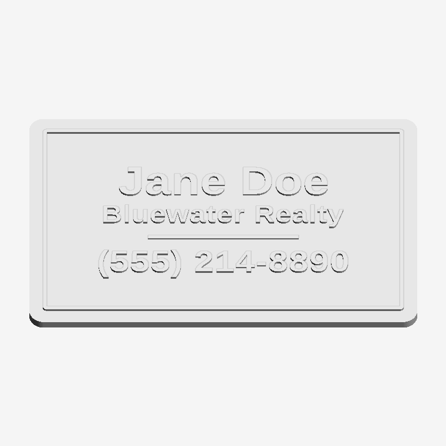
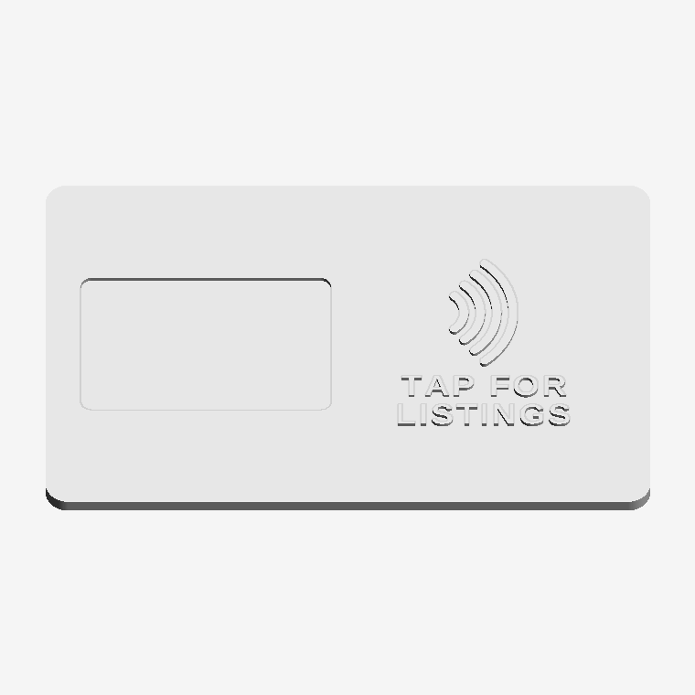
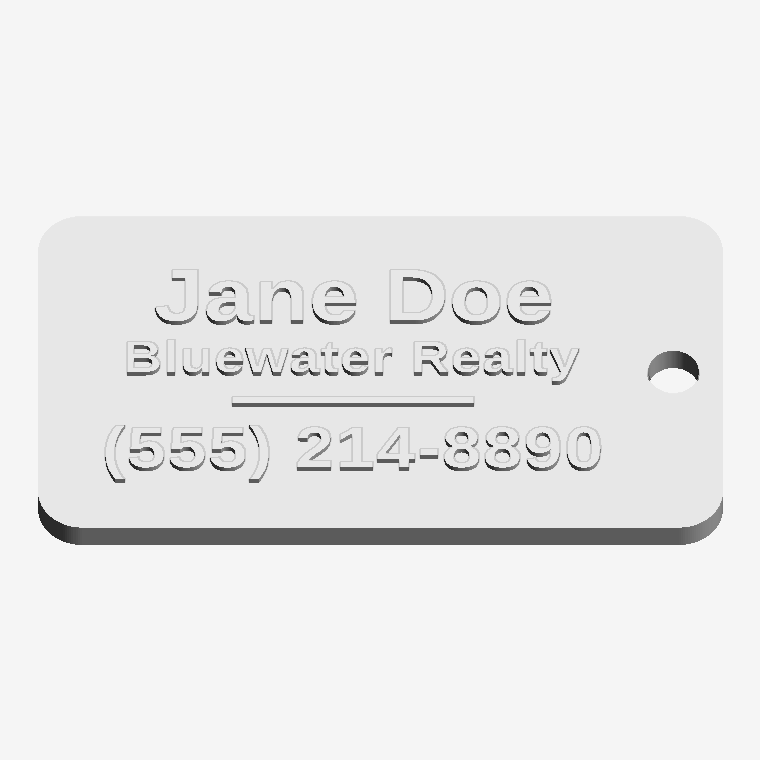
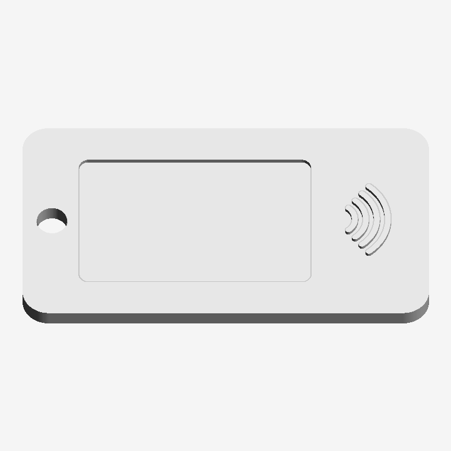
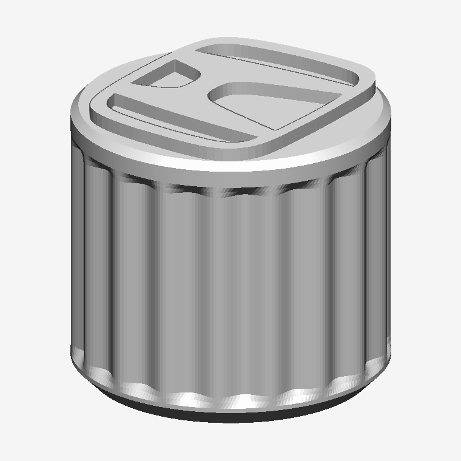
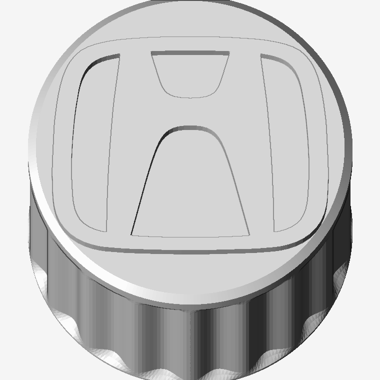

# 3D print sandbox

Two parametric things live here so far.  Both are plain Python -- shapely for
the 2-D work, trimesh and manifold for the solids -- and both re-run in seconds.

- **[Realtor NFC cards](#realtor-nfc-cards)** -- name, company and phone on the
  front; a pocket for an NFC tag and the contactless arcs on the back.  Comes
  with a browser front end.
- **[Car-brand valve caps](#car-brand-valve-caps)** -- Schrader valve stem caps
  with a car maker's emblem on top.  Twelve marks.

---

# Realtor NFC cards

Three fields in, a two-sided card or keyring fob out: the contact details
raised on the front, a pocket for an NFC tag and a "tap here" mark on the back.
Tapping a phone to it opens whatever you wrote on the tag -- a listing, a
booking page, a vCard.

| | |
|---|---|
|  |  |
|  |  |

## The app

```
pip install numpy trimesh manifold3d shapely mapbox_earcut networkx pillow fonttools
python3 src/app.py
```

opens `http://127.0.0.1:8765`.  Type in the boxes and the part rebuilds as you
go, about half a second a time; **Download STL** saves it.  The preview paints
the raised lettering in a second colour, which is not decoration -- it is
exactly what you get if you put a filament change in at the two heights the
readout gives you.

The server is standard library only and the viewer is hand-written WebGL, so
there is no framework to install, nothing fetched from a CDN, and it works with
the network off.  It listens on the loopback address; it is a tool for the
machine it runs on, not a service to put on a network.

The same thing from a terminal:

```
python3 src/gen_cards.py --name "Jane Doe" \
                         --company "Bluewater Realty" \
                         --phone "(555) 214-8890"
```

writes `stl/jane_doe_card.stl` and `stl/jane_doe_fob.stl`, and reports the
lettering sizes, the stroke widths, the pocket and the colour-change heights.
`--tag 38x19`, `--tag-mode embed`, `--tap "SCAN ME"`, `--font`, `--preview` and
the rest are in `--help`.

## The two bodies

| | Card | Fob |
|---|---|---|
| Outline | 85.6 x 54 mm, r3.18 -- CR80, the size of a credit card | 62 x 34 mm, r4, with a Ø4.6 mm split-ring hole |
| Thickness | 2.2 mm | 2.8 mm |
| Relief | 0.6 mm, both faces | 0.6 mm, both faces |
| Name / company / phone caps | 7.2 / 4.4 / 5.4 mm | 5.6 / 3.4 / 4.4 mm |
| Raised border | yes | no |
| Uses | ~10 cm³ | ~5.5 cm³ |

A line that is too long shrinks to fit rather than running off the edge, so a
long brokerage name comes out smaller, not broken.  Past a point that stops
being printable, so any of the three fields can carry a `|` where it should
break instead -- `--company "Coast & Key|Property Group"` sets two lines at
full size, which on a fob is the difference between 0.50 mm strokes and
0.36 mm ones.  The fob grows if the tag
pocket needs more room than 62 x 34 mm leaves it; the card does not, and says
so instead.

Lettering is pulled straight out of a TTF by `src/trace_text.py` -- glyph
outlines as curves, flattened, not rasterised and re-traced.  The default is
whichever of Liberation Sans Bold, DejaVu Sans Bold or Arial Bold is on the
machine; `--font` takes any other.  A heavy sans is the right answer, because
every stroke has to survive as a 0.6 mm-tall bar of plastic.

## The tag, and the arcs

The pocket is cut to the tag you actually bought: `--tag WxH` plus
`--tag-thick`, with 0.4 mm of slack all round and a floor at least 1 mm thick
under it.  Default is 35 x 22 x 0.5 mm, a common rectangular NTAG213 sticker.
**Measure yours** -- sellers' "25 mm" tags are anything but consistent.

Two ways to fit it:

| `--tag-mode` | What it does | Trade |
|---|---|---|
| `pocket` (default) | Recess open at the back; peel the sticker and press it in when the print comes off the plate. | Visible, and you can replace the tag later. |
| `embed` | The same recess roofed over with 0.6 mm of plastic. | Invisible and unpeelable, but you have to pause the print at the height it reports and drop the tag in. |

The mark beside the pocket is the four-arc contactless symbol -- the "wifi on
its side" everyone already reads as *tap here*.  It is built from arcs in
`cards.contactless()` rather than traced, so the stroke width is a number you
can turn up: 1.20 mm on the card and 0.87 mm on the fob, two to three nozzle
widths, which prints cleanly.  The NFC Forum's N-Mark and the EMVCo
indicator are registered marks and these plain arcs are neither.

Some notes on the tags themselves:

- **Nothing here writes the tag.**  Do that with a phone -- NFC Tools or
  similar -- writing a URL record, and lock it afterwards if you are handing
  them out.
- An **NTAG213 holds 144 bytes**, so about 130 characters of URL.  A listing
  link is usually longer than that: point it at a short link you control, which
  you can also re-point when the listing sells.
- Plastic is transparent at 13.56 MHz, so 1.5 mm of card over the tag costs you
  nothing.  **Metal-filled, carbon-fibre and conductive filaments are not** --
  they will kill the read.  Plain PLA, PETG, ABS and ASA are all fine.

## Printing

The STL comes out **front face down**, which is how to print it: the front
lettering gets the build-plate finish instead of being four thin top layers,
and the pocket opens upward so nothing has to bridge over it.  No supports
either way.

- **Layer height 0.12-0.20 mm.**  The relief is 0.6 mm, so that is three to
  five layers of lettering.
- **Thin-wall detection on.**  At these sizes the smaller lines run 0.5-0.65 mm
  wide -- printable, but only if the slicer does not decide to drop them.  The
  generator prints the measured width of every line, and warns when one is
  under 0.8 mm.  If you want them fatter, shorten the text or raise the cap
  heights in `src/cards.py`.
- **Two colours without a multi-material printer:** two filament changes, at
  the heights reported for the part -- Z = 0.60 mm and Z = 2.80 mm for a card,
  0.60 and 3.40 for a fob.  Start in the accent colour, swap to the body colour
  at the first, swap back at the second, and both faces come out with coloured
  lettering on a plain body.  One change at 0.60 mm alone gets you the front.
- **Material:** PLA is fine for something that lives in a wallet.  PETG if it
  is going to sit on a dashboard in the sun.
- 3-4 perimeters, 20%+ infill.  A card is about 10 cm³ and a few minutes.

## Changing things

`src/cards.py` holds the lot: `CARD` and `FOB` carry every dimension, `TAG` the
default tag, `MIN_STROKE` the printability threshold the warnings use.  Both
bodies are prismatic, so everything is a shapely polygon extruded between two
heights and handed to one boolean -- add a logo by returning more polygons from
`front_face()`.

Three things that bite, the same three the valve caps ran into:

- Hand the boolean engine the strokes *separately* rather than a shapely union
  of them.  A union of touching shapes is "valid", but its boundary touches
  itself and extruding that is not watertight.
- The front face is laid out as you read it and then **mirrored**, because it
  ends up pointing at the build plate.  Anything that has to dodge the fob's
  ring hole has to dodge it on the other side -- `content_box(mirrored=True)`.
- `2 * area / perimeter` is the stroke-width estimate.  It reads low on
  letterforms with counters, whose perimeter runs well ahead of their area, so
  treat the reported number as a floor.

Personal cards are kept out of git: `stl/*_card.stl` and `stl/*_fob.stl` are
ignored, so `gen_cards.py` can write straight into `stl/` without the repo
filling up with other people's phone numbers.

---

# Car-brand valve caps

Schrader valve stem caps with a car maker's emblem on top. Twelve marks so
far, all off the same parametric cap body.

| | |
|---|---|
|  |  |

## The caps

The **flat top** is the main one: Ø14.0 × 13.1 mm, knurled, flat face with the
emblem raised 0.6 mm so a single filament change prints the logo in a second
colour.

All are `stl/<brand>_valve_cap_flat_top.stl`:

| Brand | Emblem width | Narrowest stroke | Narrowest gap |
|---|---|---|---|
| honda | 11.9 mm | 0.59 mm | 1.52 mm |
| bmw | 13.1 mm | 1.01 mm | 2.09 mm |
| mercedes | 13.1 mm | 0.75 mm | 2.09 mm |
| toyota | 13.1 mm | 0.57 mm | 0.42 mm |
| audi | 13.1 mm | 0.56 mm | 2.09 mm |
| volkswagen | 13.1 mm | 0.59 mm | 2.09 mm |
| jeep | 13.1 mm | 0.55 mm | 0.41 mm |
| chevrolet | 12.8 mm | solid | — |
| mitsubishi | 9.9 mm | solid | 0.71 mm |
| volvo | 9.2 mm | 0.56 mm | 1.52 mm |
| ford | 13.1 mm | solid | 0.46 mm |
| ford_script | 20.6 mm | solid | 0.29 mm |

`ford_script` is the only one on a **Ø22 mm body** rather than Ø14 — the real
script does not survive a smaller cap, see below. Same thread, same height.

Chevrolet and Mitsubishi are solid shapes rather than outlines, so "narrowest
stroke" doesn't apply — their only fine detail is the pointed corners, which
round off by about a nozzle width and look fine for it. Ford is inverted: the
raised part is the whole oval and the *letters* are the gaps, so its 0.46 mm
figure is the width of the lettering.

Emblem widths differ because what actually constrains the mark is the *radius*
of the flat face (6.65 mm), not its width. Honda's wide rounded rectangle hits
that limit at the corners; Mitsubishi and Volvo look narrow in the table but
reach the same 6.55 mm radius, because their widest points aren't horizontally
opposed. `logos.fit_width(name, 6.55)` computes the number for a new mark.

Two more shapes exist for Honda:

| STL | Size (mm) | What it is |
|---|---|---|
| `stl/honda_valve_cap_flat_top_engraved.stl` | Ø14.0 × 12.5 | Same cap with the emblem **recessed 0.5 mm** — for paint fill, or a subtler look. |
| `stl/honda_valve_cap_badge.stl` | 15.0 × 12.2 × 13.2 | Ø11.6 knurled body flaring into an **emblem-shaped badge plate** with the logo raised on it. |

The badge shape only earns its keep when the mark has a distinctive silhouette.
For a circular logo the plate is just a circle, which is the flat top with extra
steps — so BMW and Mercedes don't get one.

`previews/` has an isometric, a top-down and a cutaway render of each.

## About the emblems

Honda is traced from the supplied `honda_logo.glb`. The rest are built from
primitives in `src/logos.py` — circles, ellipses, wedges, bars and mitred
polylines — which is both easier and better than tracing a mesh: the symmetry
is exact, and every stroke width is a number you can turn up until it prints.

Deliberate departures from the real marks, all of them forced by the 0.4 mm
nozzle at this size:

- **BMW** has no lettering in the outer band — at 13 mm across it would be
  under a millimetre tall, a smear rather than text. The raised parts are the
  band plus two diagonally opposite quarters, so the filament change gives you
  the quartered roundel rather than a flat outline.
- **Toyota**'s inner T sits further off the outer ellipse than in the real
  logo, opening the tightest gap from 0.24 mm to 0.42 mm.
- **Audi**'s rings are drawn noticeably heavier. Correct proportions put the
  stroke at 0.28 mm, which nothing will hold; these are 0.56 mm.
- **Volkswagen**'s W sits lower than in the real mark, to keep a printable gap
  under the point of the V.
- **Volvo** is the iron mark only — the ring and arrow, no wordmark band.
- **Jeep** is the seven-slot grille and headlights, not the wordmark.
- **Ford** comes in two versions — see below.

### The two Fords

Both are built inside out from the other marks. Rather than lettering standing
proud of the cap, the whole oval is raised and the letters are cut *through* it
down to the flat top face. A filament change at that height gives a coloured
oval with the letters in the body colour, which is how the badge really reads —
and it replaces fragile standing letters with one solid pad.

**`ford`** — block capitals, Ø14 mm cap, 0.46 mm letters. Prints on a 0.4 mm
nozzle like everything else here.

**`ford_script`** — the real Ford script and oval rings, traced from the actual
logo artwork, on a Ø22 mm cap.

The size difference is not a stylistic choice. The script is a copperplate hand
whose upstrokes are hairlines. Measured on the real outline at a 13.1 mm oval:

| | median channel | under 0.40 mm |
|---|---|---|
| script at 13.1 mm oval | 0.19 mm | 95% of the lettering |

That is half a nozzle width. Fattening it does not rescue it either — widening
the channels to a printable 0.45 mm starves the pad *between* the strokes down
to 0.09 mm, so you trade one unprintable feature for the other. The only thing
that helps is diameter, and the cap has to grow a long way:

| Oval | Cap | Channel | Pad between | Verdict |
|---|---|---|---|---|
| 13.1 mm | Ø14 | 0.19 mm | 0.21 mm | will not resolve at all |
| 20.6 mm | Ø22 | 0.29 mm | 0.33 mm | **shipped** — needs a 0.25 mm nozzle |
| 28 mm | Ø30 | 0.41 mm | 0.45 mm | works on 0.4 mm, but that's a jar lid |

So `ford_script` needs a **0.25 mm nozzle or finer**, at 0.1 mm layers. On a
0.4 mm nozzle the script will fill in and you'll get a plain raised oval — use
`ford` instead. If you want the 0.4 mm-nozzle version anyway, set `od` and
`EMBLEM_W` for `ford_script` to the bottom row and re-run; nothing else needs
to change, the thread stays the same.

### Tracing lettering

Two tracers feed these:

- `src/trace_svg.py` takes an SVG logo. Subpaths are combined under the even-odd
  rule — which is just an XOR of them, so arbitrarily nested rings come out
  right (Ford's oval is four deep: rim, white ring, navy field, lettering). It
  emits a solid `pad` and the `cuts` knocked out of it, which is exactly what
  `PADS` wants.
- `src/trace_text.py` takes a string and a TTF and pulls glyph outlines straight
  out of the font with fontTools, flattening the curves rather than rasterising
  and re-tracing. `src/ford_wordmark.json` is "FORD" in Outfit Bold (SIL OFL),
  picked because it measured widest of the fonts to hand at the size that fits.

```
python3 src/trace_svg.py logo.svg src/ford_script.json
python3 src/trace_text.py FORD /path/to/Font.ttf src/ford_wordmark.json
```

## The thread

The bore is the real **Schrader valve stem thread: 0.305"-32 UNS** (what's on a
TR413 and every other standard car/truck rubber snap-in stem):

- major Ø 7.747 mm, pitch 0.79375 mm (32 TPI), 60° UN profile
- cut with a uniform **0.15 mm radial clearance**, so the cap's thread crests
  sit at Ø7.19 and its roots at Ø8.05
- ~9 mm of engagement (≈11 turns) plus a 45° lead-in chamfer at the mouth

If it binds on your printer, raise `THREAD_CLEARANCE` in `src/generate.py` to
0.20 and re-run. If it's sloppy, drop it to 0.10.

> These are decorative caps, not sealing caps. The valve core holds the air;
> a cap keeps dirt out. Don't rely on it for pressure.

## Printing

**Orientation:** logo face **down on the build plate**, open threaded end up.
No supports needed either way, but face-down gives the crispest logo — the
0.6 mm-wide bars get the build-plate finish instead of being 4 thin top layers.
Flipping it (emblem up) is also fine and looks better if you care more about
the knurling.

**Settings**

- Layer height **0.12–0.15 mm**. The thread pitch is only 0.794 mm, so 0.2 mm
  layers give you ~4 layers per turn and a mushy thread.
- 3–4 perimeters, 25%+ infill. Each cap is ~1.1–1.4 cm³, so it's a few minutes
  and a gram of filament.
- 0.4 mm nozzle is fine, but enable thin-wall / "detect thin walls" so the
  slicer doesn't drop the narrow strokes — see the table above for the
  narrowest one in each mark (0.57 mm at worst).

**Material:** PETG, ASA or nylon. A wheel well in summer sun gets well past
PLA's softening point, and PLA also goes brittle with UV — it'll crack and you
lose the cap. ASA is the nicest of the three outdoors.

**Two colours without a multi-material printer:** insert a filament change at
**Z = 12.50 mm** — every cap here puts its top face at exactly that height —
and everything above it, the raised emblem, prints in the second colour.
Printing logo-face-down instead, start in the emblem colour and change at
Z = 0.60 mm (flat top) / 0.70 mm (badge). To get the whole top disc in the
second colour rather than just the logo, print emblem-up and move the change
down a millimetre or so.

For the engraved version, print it in one colour and wipe acrylic paint or a
paint pen into the recess, then scrape the top flat with a card once it skins over.

## Regenerating

```
pip install numpy trimesh manifold3d shapely mapbox_earcut networkx pillow scipy
python3 src/generate.py     # writes stl/
python3 src/render.py       # writes previews/
```

Everything is driven by the constants at the top of `src/generate.py` — cap
diameter, height, flute count and depth, per-brand emblem width, how far the
logo stands proud, thread clearance. `BUILDS` lists which brand/variant pairs
get written; any brand can use any variant. Change and re-run; the whole set
takes about ten seconds.

`src/logo_outline.json` is the Honda silhouette (exterior ring + 4 holes)
pulled out of the source `.glb` by `src/extract_outline.py`. The `.glb` itself
isn't committed (it's a 7 MB third-party model); to regenerate the outline:

```
python3 src/extract_outline.py path/to/honda_logo.glb
```

### Adding a brand

Write a builder in `src/logos.py` returning a list of shapely polygons — the
strokes of the mark — normalised to an overall width of 2.0, register it in
`LOGOS`, add a width to `EMBLEM_W` and a line to `BUILDS`.

Three things that bite:

- Return the strokes *separately* rather than pre-unioning them. A shapely
  union of touching strokes is "valid", but its boundary touches itself where
  they meet and extruding that gives a non-watertight mesh. `generate.py`
  extrudes each stroke and lets the boolean engine weld them, which is robust.
- Where a stroke meets a ring, run it **past** the outer edge and clip it back
  with `.intersection(disc)`. Ending it inside the ring instead leaves a
  hairline sliver along the ring's inner edge.
- Cutting one primitive with another can leave a duplicate vertex where the cut
  crosses an axis, which earcut turns into a degenerate triangle. `_dedupe()`
  in `load()` catches it, and `emblem_prisms()` fails loudly if one slips
  through.

`build_flat()` checks the emblem fits inside the flat face and refuses to emit
a cap if not.

Marks built from lettering or fine illustration — Nissan's wordmark, Subaru's
star cluster, any of the crests — aren't worth constructing by hand. Trace them
instead: `src/trace_svg.py` from an SVG, `src/extract_outline.py` from a `.glb`.
Check the measured stroke width before committing to a cap size; Ford above is
the cautionary tale.

These are manufacturer trademarks — caps for your own car, not for selling.
