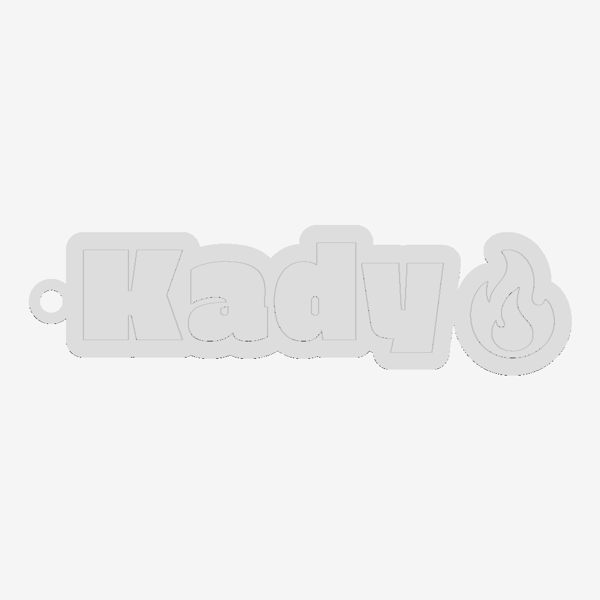
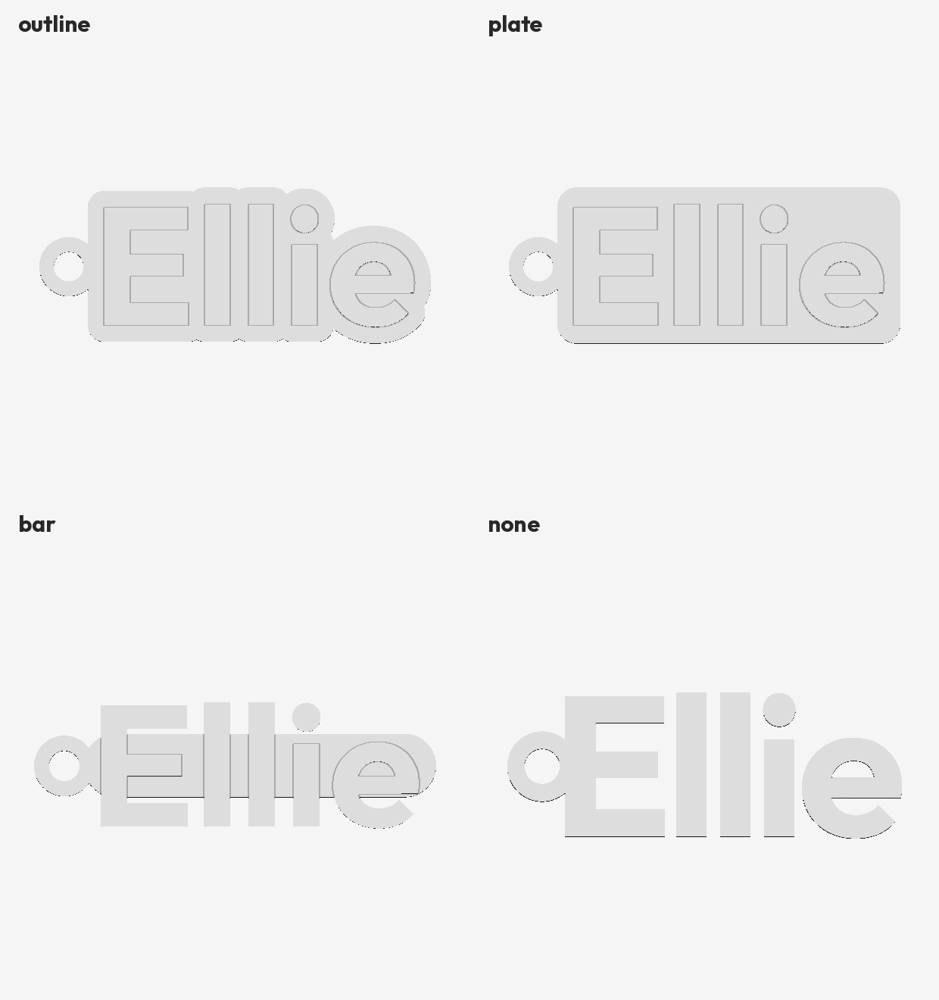
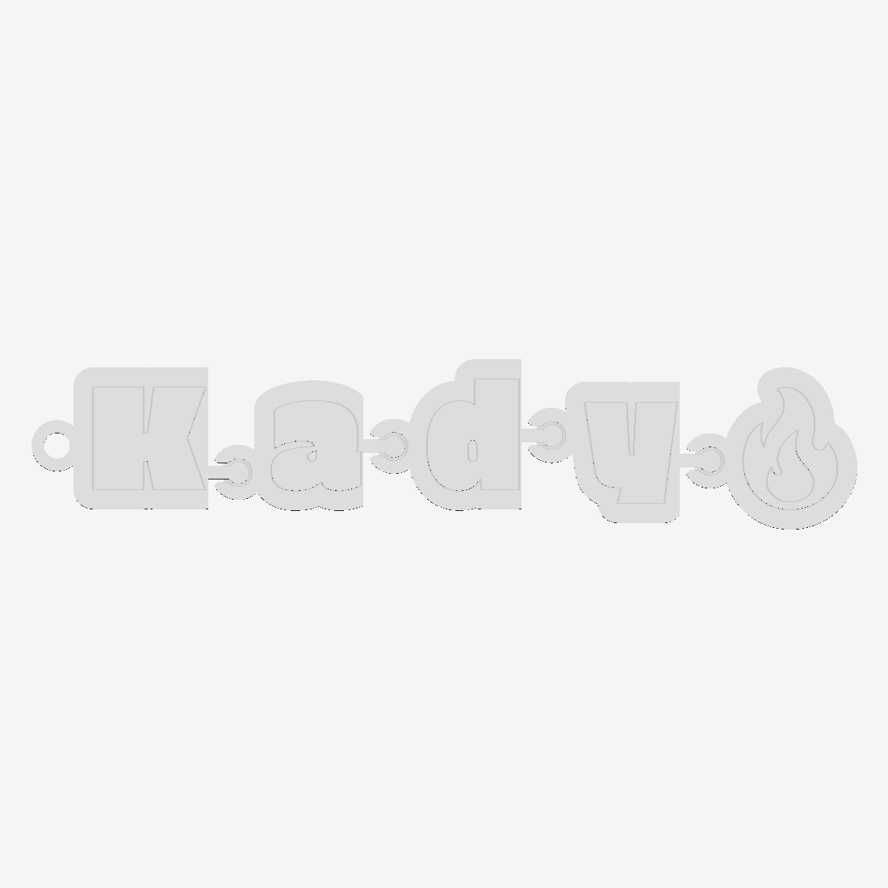
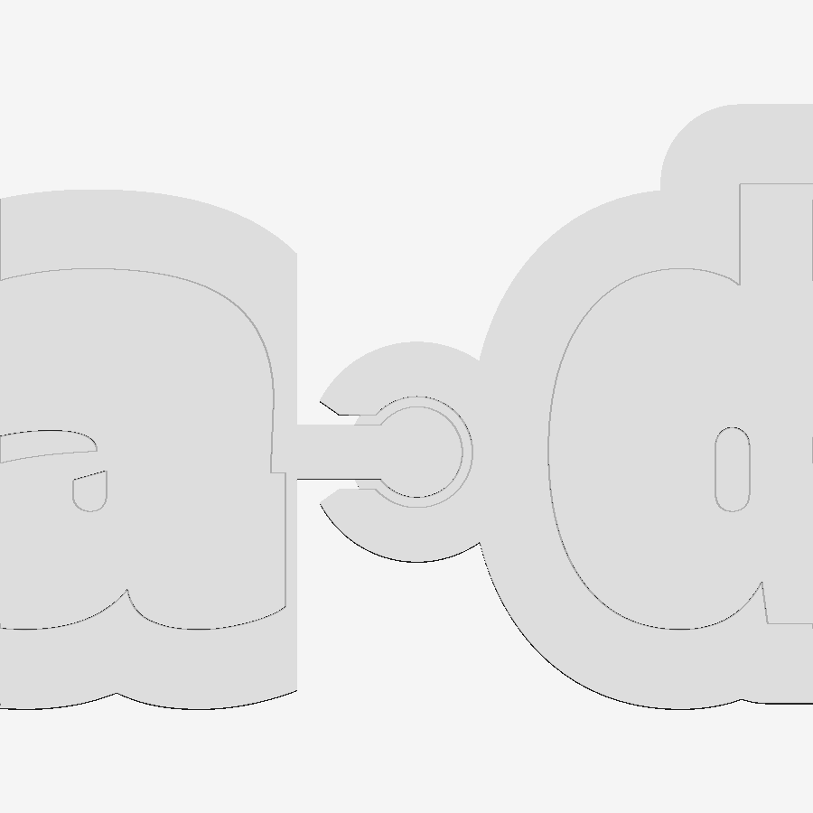

# 3D print sandbox

Three parametric things live here so far.  All plain Python -- shapely for the
2-D work, trimesh and manifold for the solids -- and all re-run in seconds.

- **[Name keychains](#name-keychains)** -- a word, in one of ten faces, where
  the lettering *is* the part.  Emoji included.  Cut it into links that come
  off the plate already hinged.
- **[NFC cards and fobs](#nfc-cards-and-fobs)** -- a keyring fob or a
  wallet card, printed as two halves with an NFC tag glued between them, in up
  to four colours, in one of three layouts.
- **[Car-brand valve caps](#car-brand-valve-caps)** -- Schrader valve stem caps
  with a car maker's emblem on top.  Twelve marks.

The first two share a browser front end: `python3 src/app.py`, then pick which
of them you are making and the form asks for what that one needs.

---

# NFC cards and fobs

Five fields in, a keyring fob or a business card out: your details on the
front, laid out by one of three layouts; a pocket for an NFC tag and the
contactless arcs on the back.
Tapping a phone to it opens whatever you wrote on the tag -- a listing, a
booking page, a vCard -- and pointing a camera at the QR code does the same for
phones that do not tap.

Two things shape everything below.  **It prints as two halves** that you glue
together with the tag sandwiched between them, so nothing of the tag shows and
neither face has a hole in it.  And **everything you can see is an inlay in one
thin face layer**, 0.6 mm deep, in up to four colours -- so a multi-material
printer does all its colour changes in the first three layers of each half and
prints the rest in one colour.

| | |
|---|---|
|  |  |
|  |  |

Top, the two faces of the finished fob.  Bottom left, what it is: two halves and
the tag that goes between them.  Bottom right, the same two halves as they print,
both face down on one plate.

## What goes on it

The field list is not arbitrary.  Every guide to business cards names the same
five things -- **name, job title, company, phone, email** -- and then warns
against a sixth and a seventh: a card with five to seven pieces of contact
information gets followed up on, and one with ten does not
([Wave Connect](https://wavecnct.com/blogs/news/what-to-put-on-business-card),
[Vistaprint](https://www.vistaprint.com/hub/business-card-information-essentials),
[UPrinting](https://www.uprinting.com/10-parts-of-modern-business-cards.html)).
So those five are the fields, each one optional, and the rest -- fax numbers,
a postal address, a row of social handles -- is deliberately not offered.

The one modern addition worth making is a link, which is what this thing is
for: an NFC tag and a QR code both point at a URL you control and can
re-point later without reprinting a single card.

On size, there are three standards and they are close enough to be confusing:

| | Size | Where |
|---|---|---|
| US | 88.9 x 50.8 mm (3.5 x 2 in) | North America |
| ISO 7810 ID-1 / CR80 | **85.6 x 54 mm** | credit cards, and what this generates |
| EU / UK | 85 x 55 mm | Europe |

The card here is CR80, the credit-card outline, because that is the one that
fits the card slot in a wallet -- the place a plastic card has to survive
([Gelato](https://www.gelato.com/blog/business-card-size-guide),
[PrintPlace](https://www.printplace.com/articles/standard-business-card-sizes),
[Blank Plastic Cards](https://www.blankplasticcards.com/blog/what-is-cr80-card-size-the-complete-guide-to-standard-plastic-card-dimensions/)).
A US card is 3.3 mm wider and 3.2 mm shorter, a European one 0.6 mm narrower
and 1 mm taller; `CARD` in `src/cards.py` is two numbers if you want either.

## The app

```
pip install numpy trimesh manifold3d shapely mapbox_earcut networkx pillow fonttools segno svgpathtools
python3 src/app.py
```

opens `http://127.0.0.1:8765`.  Type in the boxes and the part rebuilds as you
go, about half a second a time.

**The page opens with one question on it.**  A keychain, a fob and a card are
different objects with almost nothing in common to ask about, so until one of
them is picked there is nothing else on the screen -- no NFC tag sizes on the
way to a keychain, no letter spacing on the way to a business card.  Pick one
and that one's form appears, in the order the decisions come: for a keychain,
the word, then the shape behind it, then the key ring, then hinges; for a fob
or a card, who you are, how it looks, the tap side, and a batch of them.
Picking a different card at the top swaps the whole form.

**Every control lights up what it makes.**  Put the cursor in the Email box, or
just run it over the label, and the email on the part turns cyan while
everything else goes grey; the readout at the top left names what you are
looking at.  If the thing lives on the other face -- the tap mark, the QR code
-- the part turns over to show you.  If it is the tag itself, the view opens
the joint and lights the tag sitting in it.  It is the quickest way to answer
"which bit does this change?", and it needs no explaining: every run of
triangles the server sends carries the field it came from.

The viewer has three views of the same part, because a thing that prints in two
pieces and arrives as one needs both told: **Glued up** is the finished fob,
**Pulled apart** opens the joint and puts the tag in the gap, and **On the
plate** is the two halves lying face down the way they print.  The buttons are
top right; they only appear when there are two halves to show.

**Download 3MF** saves the part with each colour as a separate component in one
object, so Bambu Studio, PrusaSlicer or Orca open it already knowing which
filament goes where -- assign four and print.  **STL** saves one welded solid
instead, for anything that does not read 3MF.

A slider sets how far the lettering stands off the face.  The default is flush,
which is the point of the face layer: a smooth card you read rather than feel,
with every colour in the same three layers.  Turn it up and the lettering
stands proud -- 1.2 mm is enough to feel with a thumb -- at the cost of a
colour change on every layer the relief runs through.

The link box counts the bytes an NDEF record would take and says which NTAGs it
fits; tick **QR code** and the same link is laid into the back as a code.  An
SVG in the **Logo** picker goes on the front beside the name; an SVG in the
**Full front design** picker *is* the front -- your own artwork, lettering and
all, scaled to fill the face.  Whenever a code or a logo is on the part, the
readout names the **nozzle it needs** -- see below.  Nothing here writes a tag.

The **Batch** box takes one person per line -- name, company, phone, link --
with commas or tabs between, so a column of a spreadsheet pastes straight in.
While there is anything in it, the preview and both downloads are the whole
batch laid out on one plate, wrapped to the plate width you give it, every card
sharing the settings above it and each carrying its own link.


The page is styled on Figma's [Simple Design
System](https://www.figma.com/community/file/1380235722331273046/simple-design-system):
Inter, a near-black brand colour on white, 1 px borders, 8 px radii and an
8-based spacing scale, with its token names kept in the stylesheet's `:root` so
the values can be swapped for the file's own.  The server is standard library
only and the viewer is hand-written WebGL, so there is no framework to install,
nothing fetched from a CDN, and it works with the network off.  It listens on
the loopback address; it is a tool for the machine it runs on, not a service to
put on a network.

### Hosting it

The repo deploys to Vercel as it stands: `api/model.py` hands Vercel the same
`Handler` the local server uses, `public/` is the page and `requirements.txt`
the dependencies; `.vercelignore` keeps the valve-cap STLs out of the build.
Zero-config, with one thing that is easy to get wrong: Vercel finds the
handler by looking *inside* the entrypoint for a class defined there -- import
one under the name and the file builds as nothing, silently.  It lives at
**https://3-d-print-sandbox.vercel.app** -- the Vercel project is linked to
this repo, so every push builds: the default branch goes to that address, any
other branch gets a preview address of its own (which asks for a Vercel login;
the production one is public).  The URL then works from any phone or laptop
with nothing installed.

Two things follow from running on a function: the preview comes back gzipped (a
batch plate would otherwise hit the response ceiling), the first request after a
quiet spell takes a few seconds while Python and the geometry libraries load,
and a batch of more than a few dozen QR cards will run past the 60-second limit
-- split it, or run that one locally.

The same thing from a terminal:

```
python3 src/gen_cards.py --name "Jane Doe" \
                         --company "Bluewater Realty" \
                         --phone "(555) 214-8890"
```

writes `stl/jane_doe_fob.3mf` and the two halves as `.stl`, and reports the
lettering sizes, the stroke widths, the cavity and where the colours are.
`--kind card`, `--look navy`, `--layout student`, `--role "Senior Agent"`,
`--email jane@example.com`, `--logo-box`,
`--colours "#1f2a44,#2c3a5c,#e8c15a,#cfd3d6"`, `--logo brand.svg`,
`--design front.svg`, `--link URL --qr`, `--batch people.txt`, `--rise 1.2`,
`--format 3mf`, `--tag 38x19`, `--tag-mode pocket|embed|split`,
`--tap "SCAN ME"`, `--border`, `--chamfer 0`, `--font`, `--preview` and the rest
are in `--help`.

## The face, and the four colours

The face is one layer of the print, `FACE` = 0.6 mm deep, and everything
visible is cut into it and filled: the body colour wherever nothing else is,
then three more.

| Slot | What it carries |
|---|---|
| **body** | the slab, and the face wherever nothing else is |
| **pattern** | the background pattern |
| **primary** | name, phone, logo, the contactless arcs, the QR code |
| **secondary** | company, the rule under it, the tap wording, the border |

Printed face down, that is the first three layers at 0.2 mm.  All four
filaments are used there and nowhere else, so the tool changes -- the slow,
wasteful part of multi-material printing -- happen at the very bottom of the
part and the remaining 1 mm of each half prints in one colour.  The readout
gives the band as a height, so the same thing works on a single-nozzle printer
with a filament change or two.

### The looks

A **preset** is a layout, a pattern and four colours together.  Ten of them
ship, in `src/looks.py`, and picking one sets every control below it; change
any of them afterwards and the preset box says Custom.


Left to right, top row: **Print Lab** (the default), **Student**,
**Corporate**, **Citrus**, **Slate**; bottom row: **Paper**, **Navy**,
**Forest**, **Ember**, **Plain**.

The patterns come in two kinds.  The line ones -- `cubes`, `stripes`, `grid`,
`hexes`, `rings`, `dots` -- are strokes, and `looks.STROKE` is their width:
1.1 mm, two nozzle widths and a bit.  The solid ones -- `disc` (a big circle
off the top-right corner), `hexband` (hexagons along the bottom edge) and
`badge` (both) -- are areas, and are what the `corporate` layout is drawn to
sit on.  All of them are built as geometry rather than drawn as pixels, so
every width is a number you can read and print.

Each is clipped to the face inside the chamfer, and to a 1.25 mm halo round
everything else on it, so the lettering keeps its air and stays legible where a
big shape runs behind it.  Anything left narrower than half a stroke, or
smaller than `MIN_PIECE`, is dropped rather than printed as a speck.  The
hexagons in a band are drawn at 88% of their cell for the same reason the
strokes are handed to the boolean separately: packed edge to edge they union
into one polygon whose boundary touches itself, and that will not extrude.

### The layouts

A **layout** decides where the fields go on the front.  Three ship, and the
fields they use differ, so `role` and `email` sit empty until a layout has a
place for them.

| `--layout` | What it is | Uses |
|---|---|---|
| `centred` | Name, company, title, a rule, then phone and email, stacked in the middle, with a logo to the left of them.  Shrinks to fit rather than running off the face, which is what six lines on a fob would otherwise do.  The one that copes with a fob. | all five, logo |
| `student` | Name big at the top left, a logo square at the top right, two lines of who-you-are under the name, and an address along the bottom right behind a pair of chevrons. | name, title, company, email or phone, logo |
| `corporate` | A mark and the company across the top left, a slogan under it, the person down in the bottom left.  Leaves its bottom eighth clear for a `badge` pattern. | company, title, name, phone, email, logo |

The chevrons in front of the address are built from a polyline in
`cards.chevrons()` rather than set from the font's own `>`, for the reason the
contactless arcs are: the stroke width is then a number you can turn up until
it prints.

A layout that expects a logo and has not been given one can draw a
**placeholder** instead -- `--logo-box`, or the checkbox in the app.  It is a
placeholder in the literal sense, an empty square with the word Logo in it,
showing where the artwork goes and how big it can be; hand over an SVG or turn
it off before printing the real thing.  The `corporate` layout falls back to a
plain hexagon, which is a mark rather than a note to yourself.

Small type is what bites here.  A layout that fills a card puts three or four
sizes on it, and the smallest of them -- an email address along the bottom --
comes out around 2.5 mm tall with strokes near 0.4 mm.  That is an *inlay*, a
cut in the face that another filament has to fill, so it wants a 0.4 mm nozzle
at the outside and prints better on a 0.3.  The readout names every line it
measures under 0.8 mm; believe it, and shorten the text or move up a body size
rather than hoping.

### Colours in your own artwork

`--logo` and `--design` read the **fill of every shape** in the SVG and send it
to the slot whose colour it is nearest, so a logo drawn in two colours prints in
two.  Shapes filled in the body colour are dropped as background -- draw your
card on a black rectangle, pick a look with a black body, and what you get is
the artwork on the body at the rectangle's size, which is what you meant.
Shapes with no fill at all go to primary.

## The two bodies

| | Fob (default) | Card |
|---|---|---|
| Outline | 62 x 34 mm, r4, with a Ø4.6 mm split-ring hole | 85.6 x 54 mm, r3.18 -- CR80, the size of a credit card |
| Thickness | 1.6 mm a half, 3.2 mm glued up | 1.3 mm a half, 2.6 mm glued up |
| Face | 0.6 mm, four colours | 0.6 mm, four colours |
| Name / company / phone caps | 5.6 / 3.4 / 4.4 mm | 7.2 / 4.4 / 5.4 mm |
| Border | no | optional |
| Edge | 0.6 mm chamfer, both outer faces | same |
| Uses | ~6 cm³ | ~11 cm³ |

The fob is the default because it is the one people keep: it goes on a keyring,
it is cheaper in filament and time, and it grows if the tag or the QR code needs
more room than 62 x 34 mm leaves them.  The card does not grow, and says so
instead.

A line that is too long shrinks to fit rather than running off the edge, so a
long brokerage name comes out smaller, not broken.  Past a point that stops
being printable, so any of the three fields can carry a `|` where it should
break instead -- `--company "Coast & Key|Property Group"` sets two lines at
full size, which on a fob is the difference between 0.50 mm strokes and
0.36 mm ones.

The outer edges carry a 45° chamfer of 0.6 mm -- it is what stops a card
feeling like a coaster.  It is a true loft, not a stack of steps:
`rounded_rect()` and the same rectangle inset by the chamfer are built the same
way, so they correspond vertex for vertex and skin cleanly.  `--chamfer 0` for a
square edge.  Only the outer faces get it; the glue joint stays square.

Lettering is pulled straight out of a TTF by `src/trace_text.py` -- glyph
outlines as curves, flattened, not rasterised and re-traced.  The default is
whichever of Liberation Sans Bold, DejaVu Sans Bold or Arial Bold is on the
machine; `--font` takes any other.  A heavy sans is the right answer, because
every stroke has to survive as a 0.6 mm-deep inlay.

## The tag, and the arcs

The cavity is cut to the tag you actually bought: `--tag WxH` plus
`--tag-thick`, with 0.4 mm of slack all round and at least 0.8 mm of plastic
over it.  Default is 35 x 22 x 0.5 mm, a common rectangular NTAG213 sticker.
**Measure yours** -- sellers' "25 mm" tags are anything but consistent.

Three ways to fit it:

| `--tag-mode` | What it does | Trade |
|---|---|---|
| `split` (default) | Two half-thickness parts to glue together with the tag sandwiched between them. | No pause, no hole in either face, nothing of the tag showing -- at the cost of a glue-up. |
| `pocket` | Recess open at the back; peel the sticker and press it in when the print comes off the plate. | One part, but the recess is visible. |
| `embed` | The same recess roofed over with 0.6 mm of plastic. | One part and invisible, but you have to pause the print at the height it reports and drop the tag in. |

The mark beside the cavity is the four-arc contactless symbol -- the "wifi on
its side" everyone already reads as *tap here*.  It is built from arcs in
`cards.contactless()` rather than traced, so the stroke width is a number you
can turn up: 1.20 mm on the card and 0.87 mm on the fob, two to three nozzle
widths, which prints cleanly.  The NFC Forum's N-Mark and the EMVCo indicator
are registered marks and these plain arcs are neither.

### The two halves

Split mode emits two parts instead of one -- `..._fob_front.stl` and
`..._fob_back.stl` from the command line, or both on one plate from the browser.
The cavity is cut half into each mating face, so the tag ends up on the neutral
plane of the finished part with a millimetre of plastic either side, which is
both the strongest arrangement and the only one where no part of the tag shows.

| | |
|---|---|
|  |  |

- The body is **0.4 mm thicker** than a one-piece version to pay for the cavity.
- **Three register pins, not four.**  Ø2.4 x 0.6 mm studs on the front half,
  0.15 mm-clearance sockets on the back.  Three corners of a rectangle make an
  L, and an L does not map onto itself under any flip or half-turn -- so the
  halves only go together one way, and you cannot glue the back on upside down
  and find out when it sets.  A tag that fills the body wall to wall leaves no
  room for pins, in which case the reported count comes back 0 and you line the
  halves up on the outline instead.
- Both halves print **face down**, so each takes its colour changes in the
  first three layers and none after.
- Glue it with plastic cement or thin CA on the flat border outside the cavity,
  not in it -- the tag does not want to be soaked.  Clamp it under a book.

### Logo, QR code, and the nozzle they need

`--logo brand.svg` puts the logo on the front, to the left of the name, at 62%
of the face height (`--logo-height` to change).  `--design front.svg` goes
further and replaces the front entirely -- name, company, phone, logo and
pattern -- with the artwork, scaled to fill the face inside the margin.  Set
your card up in Illustrator or Inkscape at 85.6 x 54 mm, convert the text to
outlines, and hand it over; the readout then says the finest thing in it and the
nozzle that needs.  `trace_svg.shapes()` reads it: paths, rects, circles,
ellipses and polygons, filled; subpaths within one element combine even-odd (so
a letter keeps its counter), separate elements union (so overlapping shapes read
as "and", not as a hole), and fills are grouped by colour.  Strokes, gradients,
text objects and transforms are ignored -- export the logo as flat outlines
first, which every vector editor will do.

`--link URL --qr` lays a QR code for the link into the back, on the right; the
cavity and the mark move to the left.  The code is sized to the room it has, and
that is the whole game: **a shorter link is a coarser code, and a coarser code
prints on a bigger nozzle.**

| Link | Modules | Module on a card | Needs |
|---|---|---|---|
| `https://bit.ly/abc123` (22 chars) | 25 | 1.28 mm | 0.6 mm nozzle |
| realtor.ca listing link (80 chars) | 37 | 0.91 mm | 0.4 mm nozzle |
| realtor.ca agent link (108 chars) | 41 | 0.83 mm | 0.4 mm nozzle |

The rule behind "needs" is that a feature prints clean when **two extrusion
lines fit across it**, so the nozzle a feature needs is the largest common one
no more than half its width.  The same rule is applied to the finest detail in
the logo -- counting its holes, since a counter narrower than a nozzle fills in
exactly as a stroke narrower than one smears -- and the readout reports the
tighter of the two.  A code that would need modules under 0.5 mm is refused
rather than printed unreadable: use a shorter link, or the fob, which grows to
fit its code at 0.8 mm a module.

Two things about the code as printed: it is the *primary* colour that is dark to
a scanner, so keep primary darker than body if you can (navy on white scans;
white on navy is an inverted code, which most phones read and some do not).  And
the quiet zone round it is two modules rather than the four the spec asks for --
two is plenty against a matte print, and four would cost the code a size.  The
geometry is checked here by decoding it: the laid-in shapes, rasterised, read
back as the link they were made from.

Some notes on the tags themselves:

- **Nothing here writes the tag.**  Do that with a phone -- NFC Tools or
  similar -- writing a URL record, and lock it afterwards if you are handing
  them out.
- Capacity is rarely the problem.  An NDEF URI record costs the URL plus about
  8 bytes, less the 12 characters of `https://www.` that a prefix code stands
  in for.  A full realtor.ca listing link -- say the 80-character
  `.../real-estate/29064675/3-21091-lougheed-highway-maple-ridge` -- is 76
  bytes, and a 108-character agent link is 104.  **NTAG213 holds 144 bytes,
  NTAG215 holds 504 and NTAG216 holds 888**, so the whole link fits on any of
  them, with room on a 215 for a vCard beside it.  The app has a box to paste a
  link into and check.  A short link you control is still worth having, because
  you can re-point it when the listing sells.
- Plastic is transparent at 13.56 MHz, so a millimetre of plastic over the tag
  costs you nothing.  **Metal-filled, carbon-fibre and conductive filaments are
  not** -- they will kill the read.  Plain PLA, PETG, ABS and ASA are all fine.

## Printing

Both halves come out **face down**, which is how to print them: the face gets
the build-plate finish instead of being four thin top layers, and the cavity
opens upward so nothing has to bridge over it.  No supports.

- **Layer height 0.2 mm, or 0.15.**  The face is 0.6 mm, so three or four
  layers of colour and then a plain 1 mm.
- **Nozzle.**  0.4 mm prints every card in this README; the readout says when a
  code or a logo wants finer, and the table above says why.
- **Thin-wall detection on.**  At these sizes the smaller lines run 0.5-0.65 mm
  wide -- printable, but only if the slicer does not decide to drop them.  The
  generator prints the measured width of every line, and warns when one is
  under 0.8 mm.  If you want them fatter, shorten the text or raise the cap
  heights in `src/cards.py`.
- **Four colours on a multi-material printer:** open the 3MF.  Each colour is a
  separate component with its own material; assign a filament to each.  They are
  all spent in the first three layers, so the purge tower is short.
- **Fewer colours, or none:** set two or three of the four the same and the
  slicer merges them.  On a single-nozzle printer, print the STL and change
  filament at the height the readout gives.
- **Material:** PLA is fine for something that lives in a pocket.  PETG if it is
  going to sit on a dashboard in the sun.
- **Glue:** plastic cement or thin CA on the flat outside the cavity.  3-4
  perimeters, 20%+ infill.  A fob is about 6 cm³ and a few minutes.

## Changing things

`src/cards.py` holds the geometry: `CARD` and `FOB` carry every dimension, `TAG`
the default tag, `FACE` the depth of the colour layer, `RISE` the relief on top
of it, `CHAMFER` the edge break, `QR_QUIET` and `QR_MIN_MODULE` the code's
margins, `NOZZLES` the sizes the readout will name, `MIN_STROKE` the
printability threshold the warnings use.  `src/looks.py` holds the patterns and
the presets -- a new pattern is a function returning shapely polygons and a line
in `PATTERNS`.  The layouts are `LAYOUTS` in `src/cards.py`: a new one is a
function taking the content box and the fields and returning polygons by colour
slot, plus a line in that dict and one in `LAYOUT_TITLES`.

Both bodies are prismatic, so everything is a shapely polygon extruded between
two heights.  Every piece is kept as its own solid, cut out of the body and
dropped back into the hole, and filed under two things: the **colour** it
prints in, which is what the 3MF's four materials are, and the **field** it
came from, which is what lets the app light one up at a time.  Welding the lot
is what the STL is.  `export_3mf()` writes the file by
hand -- one object per part, one component per colour, four base materials --
because the structure is the whole point and forty lines of XML put it exactly
where the slicers look.

Things that bite, all of them learned here:

- Hand the boolean engine the strokes *separately* rather than a shapely union
  of them.  A union of touching shapes is "valid", but its boundary touches
  itself and extruding that is not watertight.
- Clip a pattern to a face and you get polygons with a doubled vertex where the
  cut landed on an existing one.  Earcut turns that into an open mesh, so
  `prisms()` simplifies by a micron first -- finer than anything drawn here,
  coarser than the noise.
- The front face is laid out as you read it and then **mirrored**, because it
  ends up pointing at the build plate.  Anything that has to dodge the fob's
  ring hole has to dodge it on the other side -- `content_box(mirrored=True)`.
- `2 * area / perimeter` is the stroke-width estimate.  It reads low on
  letterforms with counters, whose perimeter runs well ahead of their area, so
  treat the reported number as a floor.
- In the viewer, do not multisample.  A boolean leaves needle triangles a few
  microns across, and rounding their corners to the single precision an STL
  stores opens sub-pixel cracks between them; MSAA resolves those cracks against
  whatever is behind the face and speckles it.  Supersampling -- a canvas bigger
  than it is shown -- antialiases without ever sampling a crack.

Personal cards are kept out of git: `stl/*_card*` and `stl/*_fob*` are ignored,
so `gen_cards.py` can write straight into `stl/` without the repo filling up
with other people's phone numbers.

---

# Name keychains

Type a word and the word is the part.  The outline comes out of the glyphs
rather than off a rectangle, so what prints is the shape of the name, with
whatever is behind it there to hold it together.



Everything below is a keyword argument of `keychain.build()`; `src/app.py` is
the browser front end over it.

```python
import keychain
parts, info = keychain.build("Kady🔥", font="Erica One", backing="outline")
```

## The four backings

How much of the letterform survives as the silhouette is the first decision,
and it is the one that decides whether the thing holds together at all.



- **outline** -- the letters, fattened by one shapely buffer.  The best-looking
  of the four, because the backing follows the letterforms instead of boxing
  them in.  It also **grows its own padding** until the word is one piece: a T
  beside an o leaves a wide gap down at the baseline, and a fixed padding gets
  that wrong about as often as it gets it right.  The readout says what it
  settled on.
- **plate** -- a rounded rectangle behind the lot.  The sturdiest, and the one
  that copes with any face at any size.
- **bar** -- a strip through the middle of the line, ascenders and descenders
  standing out of it.
- **none** -- bare letters, joined only where they touch.  The handsome one and
  the one that comes off the plate in pieces unless the spacing is tight enough
  to overlap the strokes.  Take the letter spacing negative until it does; the
  readout counts the pieces before you print them, not after.

## The lettering, and the emoji

Ten faces ship in `src/fonts`, all SIL Open Font License with their licence
text alongside them.  A card is mostly its wording and one face does for it; a
keychain *is* its lettering, so the choice matters much more here -- and what a
face costs is printability.  The readout measures the narrowest stroke in the
word and names the largest nozzle that puts two extrusion lines across it:

| face | good for |
|---|---|
| Erica One | fat and round -- the easiest of them to print |
| Boldonse | heavy display, very wide |
| Outfit Bold | clean geometric sans |
| National Park Bold | friendly, slightly rounded |
| Big Shoulders Bold | tall and condensed, fits a long name |
| Liberation Sans Bold | the plain one |
| Tektur | squared off, technical |
| Lora Bold | a serif, so watch the thin strokes |
| Silkscreen | pixel, all square corners |
| Nothing You Could Do | handwriting; needs a backing behind it |

**Emoji work** -- 🔥 ⭐ 🔑 🏠 🐶 -- and they come out as real extruded
outlines, not pictures.  That only works with a *monochrome* emoji font: the
colour ones your keyboard shows (Noto Color Emoji and friends) store bitmaps,
and a bitmap has no outline to extrude.  `src/fonts/NotoEmoji-Bold.ttf` is the
one that does, at weight 700 because its strokes are the fattest of the family
and so the likeliest to survive a nozzle.  `trace_text.trace()` falls back to
it per character and scales the glyph to the cap height of the face it lands
in, so the flame stands level with the K beside it rather than towering over
it.  The same fallback works on cards and fobs.

Skin-tone modifiers and the zero-width joiner are passed over rather than
refused, so 👨‍👩‍👧 comes out as its separate pieces -- the best a
per-codepoint tracer can do, and better than refusing the line.

Put a `|` where a second line should start.  Letter spacing is in millimetres
rather than in em, which is what anyone setting a keychain actually wants to
think in, and going negative with it is how a joined-up face is made to work.

## The key ring end

Four ends: **nothing**, a **hole** straight through the backing, a **tab** --
a disc off one end with a hole in it -- or a **loop**, a ring on a short neck.
Left, right or top.  4.5 mm takes the 25 mm split ring that comes on most key
rings, and the tab grows with the hole to keep 1.8 mm of wall round it, which
is what stops it tearing out.

The end hangs off the **material**, not off the bounding box.  The left of a T
is the end of its crossbar, three quarters of the way up, so a tab hung on the
corner of the box hangs in mid-air welded to nothing; `edge_point()` walks the
outline instead and takes the point that is both furthest out and nearest the
middle of the side it is on.

## Hinges

One button cuts the keychain into links that come off the plate already
articulated.  Nothing is glued, nothing is assembled, and nothing needs
supports.



Two kinds:

- **pivot** -- the head sits in a round socket.  It turns about the joint and
  does nothing else, so the letters stay in a line.
- **chain** -- the same joint with a slot in it, so every link turns *and*
  slides.  The strip prints closed up and opens by 1.5 mm at each joint, which
  is the slack that lets it drape.

### How a joint is captive



Each link ends in a head on a stalk, sitting in a socket that closes round it.

**In the plane** it cannot come out at all: the throat the stalk swings in is
`neck + 2 × clearance` wide -- 3.3 mm -- against a head of 6 mm, and no amount
of pulling gets one through the other.  The mouth flares at 35° past the
cavity, which is what the stalk swings in.

**Out of the plane** the socket is narrower in the first and last few layers
than it is in the middle, and the head is wider in the middle than at its top
and bottom, so the head's shoulder sits under the socket's lip.  Lifting a link
out means raising it clear of that lip, which is `base − band − clearance`:
about 2 mm of the 3 mm the backing is thick.  Far more than a pocket will ever
do to it, and much less than forever -- which is the honest way to put it.

The two do **not** change width at the same height.  The socket goes wide at
`band` and the head at `band + clearance`, so there is a real gap between the
underside of one lip and the top of the other shoulder.  Without it those two
faces meet exactly, and a joint whose parts share a plane is a joint the
boolean -- and then the slicer -- welds solid.  That is the one mistake here
that still looks right on screen.  It makes five bands, not three:

```
0              .. band            socket narrow, head narrow
band           .. band+clearance  socket wide,   head narrow   <- the daylight
band+clearance .. base-band-c     socket wide,   head wide
                                  and back down the same way
```

Every number is in `HINGE` in `src/keychain.py` and every one of them was
picked for a 0.4 mm nozzle.  **0.45 mm of clearance** on every side is the one
that matters most: a little over one extrusion width, which is the smallest gap
that reliably does not fuse.  Under 0.4 it welds itself shut; over 0.6 the
joint rattles.

### Where the links are cut

A joint is about ten millimetres long and the gap between two letters is about
two, so a hinged keychain **lays its letters out for its joints**: the gaps
that are going to hold one are opened to make room, and every other gap is left
exactly as it was set.

That second half matters as much as the first.  Open all of them and a link
carrying two letters is two tiles with nothing between them, which is what it
prints as.  So asking for fewer links than letters does not space the whole
word out -- it groups letters onto tiles and only opens the gaps between the
groups.

Three things can refuse, each saying what to do instead:

- **A gap the backing cannot bridge on its own** -- the space between two words
  -- must have a joint whether or not the link count asked for one, because it
  is already two tiles.
- **Two letters that do not stand level with each other** where they face
  across a gap cannot hold a stalk between them.  What faces an o across the
  gap in `To` is the end of the T's crossbar; a millimetre of it lines up with
  anything, and a stalk needs 3.3.  Those gaps are never cut, so the two
  letters ride on one link -- and if no gap in the word will take a joint, a
  plate backing gives every gap the full height of the plate to weld across.
- **Two lines** have no left-to-right chain to be part of.

Where the joint has to shrink to fit a short tile the stalk shrinks with it.
Left at full width while the head came down, the cavity closed to within fifty
microns of the stalk -- which prints as one solid piece.

## Printing

Backing down, letters up, no supports, no brim needed.  A keychain is small
enough that the whole thing is first-layer adhesion and nothing else.

The 3MF carries the backing and the letters as **two separate components** with
their own materials, so a multi-material printer opens it already knowing which
filament goes where and makes exactly one colour change, at the top of the
backing.  On a single-material printer it all comes out in one colour and still
reads, because the letters stand off the backing.

Defaults are 3 mm of backing and 1.2 mm of letters -- 4.2 mm all told, which is
chunky on purpose: the failure mode of a thin keychain is that it snaps in a
pocket.  A hinged one needs at least 2.6 mm of backing to fit the capture in,
and `build()` says so rather than printing something that falls apart.

For a chain, print it as it comes: it is drawn closed up, and every joint opens
once it is off the plate.  Give the links a wiggle with a pair of pliers before
they cool all the way and any joint that is going to be stiff will free itself.

---

# Car-brand valve caps

Schrader valve stem caps with a car maker's emblem on top. Twelve marks so
far, all off the same parametric cap body.

| | |
|---|---|
|  |  |

## The caps

The **flat top** is the main one: Ø14.0 × 13.1 mm, knurled, flat face with the
emblem raised 0.6 mm so a single filament change prints the logo in a second
colour.

All are `stl/<brand>_valve_cap_flat_top.stl`:

| Brand | Emblem width | Narrowest stroke | Narrowest gap |
|---|---|---|---|
| honda | 11.9 mm | 0.59 mm | 1.52 mm |
| bmw | 13.1 mm | 1.01 mm | 2.09 mm |
| mercedes | 13.1 mm | 0.75 mm | 2.09 mm |
| toyota | 13.1 mm | 0.57 mm | 0.42 mm |
| audi | 13.1 mm | 0.56 mm | 2.09 mm |
| volkswagen | 13.1 mm | 0.59 mm | 2.09 mm |
| jeep | 13.1 mm | 0.55 mm | 0.41 mm |
| chevrolet | 12.8 mm | solid | — |
| mitsubishi | 9.9 mm | solid | 0.71 mm |
| volvo | 9.2 mm | 0.56 mm | 1.52 mm |
| ford | 13.1 mm | solid | 0.46 mm |
| ford_script | 20.6 mm | solid | 0.29 mm |

`ford_script` is the only one on a **Ø22 mm body** rather than Ø14 — the real
script does not survive a smaller cap, see below. Same thread, same height.

Chevrolet and Mitsubishi are solid shapes rather than outlines, so "narrowest
stroke" doesn't apply — their only fine detail is the pointed corners, which
round off by about a nozzle width and look fine for it. Ford is inverted: the
raised part is the whole oval and the *letters* are the gaps, so its 0.46 mm
figure is the width of the lettering.

Emblem widths differ because what actually constrains the mark is the *radius*
of the flat face (6.65 mm), not its width. Honda's wide rounded rectangle hits
that limit at the corners; Mitsubishi and Volvo look narrow in the table but
reach the same 6.55 mm radius, because their widest points aren't horizontally
opposed. `logos.fit_width(name, 6.55)` computes the number for a new mark.

Two more shapes exist for Honda:

| STL | Size (mm) | What it is |
|---|---|---|
| `stl/honda_valve_cap_flat_top_engraved.stl` | Ø14.0 × 12.5 | Same cap with the emblem **recessed 0.5 mm** — for paint fill, or a subtler look. |
| `stl/honda_valve_cap_badge.stl` | 15.0 × 12.2 × 13.2 | Ø11.6 knurled body flaring into an **emblem-shaped badge plate** with the logo raised on it. |

The badge shape only earns its keep when the mark has a distinctive silhouette.
For a circular logo the plate is just a circle, which is the flat top with extra
steps — so BMW and Mercedes don't get one.

`previews/` has an isometric, a top-down and a cutaway render of each.

## About the emblems

Honda is traced from the supplied `honda_logo.glb`. The rest are built from
primitives in `src/logos.py` — circles, ellipses, wedges, bars and mitred
polylines — which is both easier and better than tracing a mesh: the symmetry
is exact, and every stroke width is a number you can turn up until it prints.

Deliberate departures from the real marks, all of them forced by the 0.4 mm
nozzle at this size:

- **BMW** has no lettering in the outer band — at 13 mm across it would be
  under a millimetre tall, a smear rather than text. The raised parts are the
  band plus two diagonally opposite quarters, so the filament change gives you
  the quartered roundel rather than a flat outline.
- **Toyota**'s inner T sits further off the outer ellipse than in the real
  logo, opening the tightest gap from 0.24 mm to 0.42 mm.
- **Audi**'s rings are drawn noticeably heavier. Correct proportions put the
  stroke at 0.28 mm, which nothing will hold; these are 0.56 mm.
- **Volkswagen**'s W sits lower than in the real mark, to keep a printable gap
  under the point of the V.
- **Volvo** is the iron mark only — the ring and arrow, no wordmark band.
- **Jeep** is the seven-slot grille and headlights, not the wordmark.
- **Ford** comes in two versions — see below.

### The two Fords

Both are built inside out from the other marks. Rather than lettering standing
proud of the cap, the whole oval is raised and the letters are cut *through* it
down to the flat top face. A filament change at that height gives a coloured
oval with the letters in the body colour, which is how the badge really reads —
and it replaces fragile standing letters with one solid pad.

**`ford`** — block capitals, Ø14 mm cap, 0.46 mm letters. Prints on a 0.4 mm
nozzle like everything else here.

**`ford_script`** — the real Ford script and oval rings, traced from the actual
logo artwork, on a Ø22 mm cap.

The size difference is not a stylistic choice. The script is a copperplate hand
whose upstrokes are hairlines. Measured on the real outline at a 13.1 mm oval:

| | median channel | under 0.40 mm |
|---|---|---|
| script at 13.1 mm oval | 0.19 mm | 95% of the lettering |

That is half a nozzle width. Fattening it does not rescue it either — widening
the channels to a printable 0.45 mm starves the pad *between* the strokes down
to 0.09 mm, so you trade one unprintable feature for the other. The only thing
that helps is diameter, and the cap has to grow a long way:

| Oval | Cap | Channel | Pad between | Verdict |
|---|---|---|---|---|
| 13.1 mm | Ø14 | 0.19 mm | 0.21 mm | will not resolve at all |
| 20.6 mm | Ø22 | 0.29 mm | 0.33 mm | **shipped** — needs a 0.25 mm nozzle |
| 28 mm | Ø30 | 0.41 mm | 0.45 mm | works on 0.4 mm, but that's a jar lid |

So `ford_script` needs a **0.25 mm nozzle or finer**, at 0.1 mm layers. On a
0.4 mm nozzle the script will fill in and you'll get a plain raised oval — use
`ford` instead. If you want the 0.4 mm-nozzle version anyway, set `od` and
`EMBLEM_W` for `ford_script` to the bottom row and re-run; nothing else needs
to change, the thread stays the same.

### Tracing lettering

Two tracers feed these:

- `src/trace_svg.py` takes an SVG logo. Subpaths are combined under the even-odd
  rule — which is just an XOR of them, so arbitrarily nested rings come out
  right (Ford's oval is four deep: rim, white ring, navy field, lettering). It
  emits a solid `pad` and the `cuts` knocked out of it, which is exactly what
  `PADS` wants.
- `src/trace_text.py` takes a string and a TTF and pulls glyph outlines straight
  out of the font with fontTools, flattening the curves rather than rasterising
  and re-tracing. `src/ford_wordmark.json` is "FORD" in Outfit Bold (SIL OFL),
  picked because it measured widest of the fonts to hand at the size that fits.

```
python3 src/trace_svg.py logo.svg src/ford_script.json
python3 src/trace_text.py FORD /path/to/Font.ttf src/ford_wordmark.json
```

## The thread

The bore is the real **Schrader valve stem thread: 0.305"-32 UNS** (what's on a
TR413 and every other standard car/truck rubber snap-in stem):

- major Ø 7.747 mm, pitch 0.79375 mm (32 TPI), 60° UN profile
- cut with a uniform **0.15 mm radial clearance**, so the cap's thread crests
  sit at Ø7.19 and its roots at Ø8.05
- ~9 mm of engagement (≈11 turns) plus a 45° lead-in chamfer at the mouth

If it binds on your printer, raise `THREAD_CLEARANCE` in `src/generate.py` to
0.20 and re-run. If it's sloppy, drop it to 0.10.

> These are decorative caps, not sealing caps. The valve core holds the air;
> a cap keeps dirt out. Don't rely on it for pressure.

## Printing

**Orientation:** logo face **down on the build plate**, open threaded end up.
No supports needed either way, but face-down gives the crispest logo — the
0.6 mm-wide bars get the build-plate finish instead of being 4 thin top layers.
Flipping it (emblem up) is also fine and looks better if you care more about
the knurling.

**Settings**

- Layer height **0.12–0.15 mm**. The thread pitch is only 0.794 mm, so 0.2 mm
  layers give you ~4 layers per turn and a mushy thread.
- 3–4 perimeters, 25%+ infill. Each cap is ~1.1–1.4 cm³, so it's a few minutes
  and a gram of filament.
- 0.4 mm nozzle is fine, but enable thin-wall / "detect thin walls" so the
  slicer doesn't drop the narrow strokes — see the table above for the
  narrowest one in each mark (0.57 mm at worst).

**Material:** PETG, ASA or nylon. A wheel well in summer sun gets well past
PLA's softening point, and PLA also goes brittle with UV — it'll crack and you
lose the cap. ASA is the nicest of the three outdoors.

**Two colours without a multi-material printer:** insert a filament change at
**Z = 12.50 mm** — every cap here puts its top face at exactly that height —
and everything above it, the raised emblem, prints in the second colour.
Printing logo-face-down instead, start in the emblem colour and change at
Z = 0.60 mm (flat top) / 0.70 mm (badge). To get the whole top disc in the
second colour rather than just the logo, print emblem-up and move the change
down a millimetre or so.

For the engraved version, print it in one colour and wipe acrylic paint or a
paint pen into the recess, then scrape the top flat with a card once it skins over.

## Regenerating

```
pip install numpy trimesh manifold3d shapely mapbox_earcut networkx pillow scipy
python3 src/generate.py     # writes stl/
python3 src/render.py       # writes previews/
```

Everything is driven by the constants at the top of `src/generate.py` — cap
diameter, height, flute count and depth, per-brand emblem width, how far the
logo stands proud, thread clearance. `BUILDS` lists which brand/variant pairs
get written; any brand can use any variant. Change and re-run; the whole set
takes about ten seconds.

`src/logo_outline.json` is the Honda silhouette (exterior ring + 4 holes)
pulled out of the source `.glb` by `src/extract_outline.py`. The `.glb` itself
isn't committed (it's a 7 MB third-party model); to regenerate the outline:

```
python3 src/extract_outline.py path/to/honda_logo.glb
```

### Adding a brand

Write a builder in `src/logos.py` returning a list of shapely polygons — the
strokes of the mark — normalised to an overall width of 2.0, register it in
`LOGOS`, add a width to `EMBLEM_W` and a line to `BUILDS`.

Three things that bite:

- Return the strokes *separately* rather than pre-unioning them. A shapely
  union of touching strokes is "valid", but its boundary touches itself where
  they meet and extruding that gives a non-watertight mesh. `generate.py`
  extrudes each stroke and lets the boolean engine weld them, which is robust.
- Where a stroke meets a ring, run it **past** the outer edge and clip it back
  with `.intersection(disc)`. Ending it inside the ring instead leaves a
  hairline sliver along the ring's inner edge.
- Cutting one primitive with another can leave a duplicate vertex where the cut
  crosses an axis, which earcut turns into a degenerate triangle. `_dedupe()`
  in `load()` catches it, and `emblem_prisms()` fails loudly if one slips
  through.

`build_flat()` checks the emblem fits inside the flat face and refuses to emit
a cap if not.

Marks built from lettering or fine illustration — Nissan's wordmark, Subaru's
star cluster, any of the crests — aren't worth constructing by hand. Trace them
instead: `src/trace_svg.py` from an SVG, `src/extract_outline.py` from a `.glb`.
Check the measured stroke width before committing to a cap size; Ford above is
the cautionary tale.

These are manufacturer trademarks — caps for your own car, not for selling.
